# BP-01 เก็บความยินยอมทุกช่องทาง (Consent capture)

> Trigger: เจ้าของข้อมูลสมัคร/ใช้บริการผ่านเว็บ แอป หน้าร้าน หรือระบบของพันธมิตร  
> ผลลัพธ์: Consent Transaction รายวัตถุประสงค์ + หลักฐาน + แจ้งระบบปลายทาง  
> UC: CON-09, CON-10, CON-11, CON-14, CON-15, CON-16, CON-23  
> ต้นฉบับ: `design/PDPA_System_Analysis.drawio` → หน้า **BP-01 เก็บความยินยอมทุกช่องทาง**

## Use case ที่ครอบคลุม

- [CON-09](../modules/CON.md#con-09) แบบฟอร์มขอความยินยอม (Collection Point)
- [CON-10](../modules/CON.md#con-10) ความยินยอมโดยชัดแจ้งสำหรับข้อมูลอ่อนไหว
- [CON-11](../modules/CON.md#con-11) ความยินยอมผู้เยาว์และผู้ปกครอง
- [CON-14](../modules/CON.md#con-14) เก็บความยินยอมหลายช่องทาง
- [CON-15](../modules/CON.md#con-15) หลักฐานความยินยอม (Receipt)
- [CON-16](../modules/CON.md#con-16) REST API และ Webhook
- [CON-23](../modules/CON.md#con-23) Double Opt-In

## Diagram

```mermaid
flowchart LR
    subgraph L_DS["เจ้าของข้อมูล"]
        n_s(("เริ่มสมัคร / ใช้บริการ"))
        n_t3("อ่านประกาศ เลือกยินยอมรายวัตถุประสงค์ (ไม่ติ๊กไว้ก่อน)")
        n_t7("กดยืนยันจากอีเมล / SMS")
        n_t10("ได้รับ Consent Receipt")
        n_e2((("จบ")))
    end
    subgraph L_CH["ช่องทาง: เว็บ / แอป / หน้าร้าน"]
        n_t1("เปิดฟอร์ม โหลด collection point")
        n_g1{"ผู้เยาว์ / ไร้ความสามารถ?"}
        n_t5("ส่ง consent พร้อม Idempotency-Key")
    end
    subgraph L_SYS["PDPA Platform · Consent"]
        n_t2["คืน purpose เวอร์ชันล่าสุด + ลิงก์ประกาศ"]
        n_t4["ขอความยินยอมผู้ใช้อำนาจปกครอง (ส่งลิงก์ยืนยัน)"]
        n_t6["ตรวจ key / schema / purpose version / คำขอซ้ำ"]
        n_g2{"ต้อง Double Opt-In?"}
        n_t8["บันทึก transaction + receipt (hash chain) + อัปเดตสถานะ"]
        n_t9["Outbox → webhook consent.* (retry ≤ 24 ชม. แล้วเข้า reconcile)"]
    end
    subgraph L_DOWN["ระบบปลายทาง CRM / CDP"]
        n_t11["อัปเดต preference / audience แล้วตอบ ACK"]
        n_e1((("ข้อมูลตรงกันทุกระบบ")))
    end
    n_s --> n_t1
    n_t1 --> n_t2
    n_t2 -->|"แสดงฟอร์ม"| n_t3
    n_t3 --> n_g1
    n_g1 -->|"ไม่"| n_t5
    n_g1 -->|"ใช่"| n_t4
    n_t4 -->|"อนุมัติแล้ว"| n_t5
    n_t5 --> n_t6
    n_t6 --> n_g2
    n_g2 -->|"ไม่"| n_t8
    n_g2 -->|"ใช่"| n_t7
    n_t7 --> n_t8
    n_t8 --> n_t9
    n_t8 -->|"อีเมล / หน้าจอ"| n_t10
    n_t10 --> n_e2
    n_t9 --> n_t11
    n_t11 -->|"ACK"| n_e1
    classDef human fill:#FFF2CC,stroke:#D6B656,color:#000
    classDef system fill:#DAE8FC,stroke:#6C8EBF,color:#000
    classDef gate fill:#FFE6CC,stroke:#D79B00,color:#000
    classDef timer fill:#E1D5E7,stroke:#9673A6,color:#000
    classDef startev fill:#D5E8D4,stroke:#82B366,color:#000
    classDef endev fill:#F8CECC,stroke:#B85450,color:#000
    class n_t1,n_t3,n_t5,n_t7,n_t10 human
    class n_t2,n_t4,n_t6,n_t8,n_t9,n_t11 system
    class n_g1,n_g2 gate
    class n_s startev
    class n_e1,n_e2 endev
```

สัญลักษณ์: วงกลม = เริ่ม · วงกลมซ้อน = จบ · สี่เหลี่ยมมุมมน (เหลือง) = งานของคน · สี่เหลี่ยม (ฟ้า) = งานของระบบ · ข้าวหลามตัด = gateway · หกเหลี่ยม ⏱ = timer / เหตุการณ์ตามเวลา

## ขั้นตอน

| # | node | lane | ประเภท | ขั้นตอน | API / ตาราง |
|---|---|---|---|---|---|
| 1 | s | เจ้าของข้อมูล | เริ่ม | เริ่มสมัคร / ใช้บริการ |  |
| 2 | t1 | ช่องทาง: เว็บ / แอป / หน้าร้าน | งานของคน | เปิดฟอร์ม โหลด collection point | GET /public/v1/collection-points/{key} |
| 3 | t2 | PDPA Platform · Consent | งานของระบบ | คืน purpose เวอร์ชันล่าสุด + ลิงก์ประกาศ | purposes · purpose_versions |
| 4 | t3 | เจ้าของข้อมูล | งานของคน | อ่านประกาศ เลือกยินยอมรายวัตถุประสงค์ (ไม่ติ๊กไว้ก่อน) |  |
| 5 | g1 | ช่องทาง: เว็บ / แอป / หน้าร้าน | gateway | ผู้เยาว์ / ไร้ความสามารถ? |  |
| 6 | t4 | PDPA Platform · Consent | งานของระบบ | ขอความยินยอมผู้ใช้อำนาจปกครอง (ส่งลิงก์ยืนยัน) | guardian_approvals |
| 7 | t5 | ช่องทาง: เว็บ / แอป / หน้าร้าน | งานของคน | ส่ง consent พร้อม Idempotency-Key | POST /public/v1/consents |
| 8 | t6 | PDPA Platform · Consent | งานของระบบ | ตรวจ key / schema / purpose version / คำขอซ้ำ |  |
| 9 | g2 | PDPA Platform · Consent | gateway | ต้อง Double Opt-In? |  |
| 10 | t7 | เจ้าของข้อมูล | งานของคน | กดยืนยันจากอีเมล / SMS |  |
| 11 | t8 | PDPA Platform · Consent | งานของระบบ | บันทึก transaction + receipt (hash chain) + อัปเดตสถานะ | consent_transactions · consent_status |
| 12 | t9 | PDPA Platform · Consent | งานของระบบ | Outbox → webhook consent.* (retry ≤ 24 ชม. แล้วเข้า reconcile) | outbox_events · downstream_syncs |
| 13 | t10 | เจ้าของข้อมูล | งานของคน | ได้รับ Consent Receipt |  |
| 14 | t11 | ระบบปลายทาง CRM / CDP | งานของระบบ | อัปเดต preference / audience แล้วตอบ ACK | POST {callback} → 2xx |
| 15 | e1 | ระบบปลายทาง CRM / CDP | จบ | ข้อมูลตรงกันทุกระบบ |  |
| 16 | e2 | เจ้าของข้อมูล | จบ | จบ |  |

### เงื่อนไขบนเส้นทาง

| จาก | เงื่อนไข / ข้อความ | ไป |
|---|---|---|
| t2 · คืน purpose เวอร์ชันล่าสุด + ลิงก์ประกาศ | แสดงฟอร์ม | t3 · อ่านประกาศ เลือกยินยอมรายวัตถุประสงค์ (ไม่ติ๊กไว้ก่อน) |
| g1 · ผู้เยาว์ / ไร้ความสามารถ? | ไม่ | t5 · ส่ง consent พร้อม Idempotency-Key |
| g1 · ผู้เยาว์ / ไร้ความสามารถ? | ใช่ | t4 · ขอความยินยอมผู้ใช้อำนาจปกครอง (ส่งลิงก์ยืนยัน) |
| t4 · ขอความยินยอมผู้ใช้อำนาจปกครอง (ส่งลิงก์ยืนยัน) | อนุมัติแล้ว | t5 · ส่ง consent พร้อม Idempotency-Key |
| g2 · ต้อง Double Opt-In? | ไม่ | t8 · บันทึก transaction + receipt (hash chain) + อัปเดตสถานะ |
| g2 · ต้อง Double Opt-In? | ใช่ | t7 · กดยืนยันจากอีเมล / SMS |
| t8 · บันทึก transaction + receipt (hash chain) + อัปเดตสถานะ | อีเมล / หน้าจอ | t10 · ได้รับ Consent Receipt |
| t11 · อัปเดต preference / audience แล้วตอบ ACK | ACK | e1 · ข้อมูลตรงกันทุกระบบ |

## กฎทางธุรกิจและข้อกำหนดกฎหมาย (ต้องมี test ครอบคลุม)

1. ความยินยอมต้องขอโดยชัดแจ้ง แยกจากข้อความอื่น เข้าใจง่าย และไม่ผูกเป็นเงื่อนไขของสัญญาเกินจำเป็น (ม.19)
2. ข้อมูลอ่อนไหวต้องได้ความยินยอมโดยชัดแจ้ง (ม.26) → purposes.requires_explicit = true
3. ผู้เยาว์ คนไร้ความสามารถ คนเสมือนไร้ความสามารถ ต้องได้ความยินยอมจากผู้ใช้อำนาจปกครอง / ผู้อนุบาล / ผู้พิทักษ์ (ม.20)
4. บันทึกเวอร์ชัน purpose และเวอร์ชันประกาศที่แสดง ณ เวลาที่ให้ความยินยอม เพื่อพิสูจน์ย้อนหลังได้
5. consent_transactions เป็น append-only ห้าม UPDATE/DELETE; receipt ใช้ hash chain (prev_hash) ตรวจการแก้ไข
6. Idempotency-Key ซ้ำภายใน 24 ชม. ต้องคืนผลเดิม ไม่สร้างรายการใหม่
7. ระบบปลายทางไม่ตอบ ACK: retry แบบ exponential backoff ไม่เกิน 24 ชม. แล้วเข้าคิว reconcile (BP-02)

## ข้อมูลที่เกี่ยวข้อง

- [consent.collection_points](../data/consent.md#consent-collection-points) · [consent.collection_point_purposes](../data/consent.md#consent-collection-point-purposes)
- [consent.purposes](../data/consent.md#consent-purposes) · [consent.purpose_versions](../data/consent.md#consent-purpose-versions)
- [consent.data_subjects](../data/consent.md#consent-data-subjects) · [consent.subject_identifiers](../data/consent.md#consent-subject-identifiers)
- [consent.consent_receipts](../data/consent.md#consent-consent-receipts) · [consent.consent_transactions](../data/consent.md#consent-consent-transactions) ⟨P⟩
- [consent.consent_status](../data/consent.md#consent-consent-status) · [consent.guardian_approvals](../data/consent.md#consent-guardian-approvals) · [consent.double_optin_requests](../data/consent.md#consent-double-optin-requests)
- [consent.downstream_syncs](../data/consent.md#consent-downstream-syncs) · [platform.outbox_events](../data/platform.md#platform-outbox-events)

## API / event / job

- GET /public/v1/collection-points/{key}
- POST /public/v1/consents · POST /api/v1/consents
- POST /public/v1/consents/confirm (double opt-in)
- event: consent.granted · consent.denied (ตาม transaction_type)
- webhook: HMAC-SHA256 header X-Signature, retry 1 นาที → 24 ชม.
