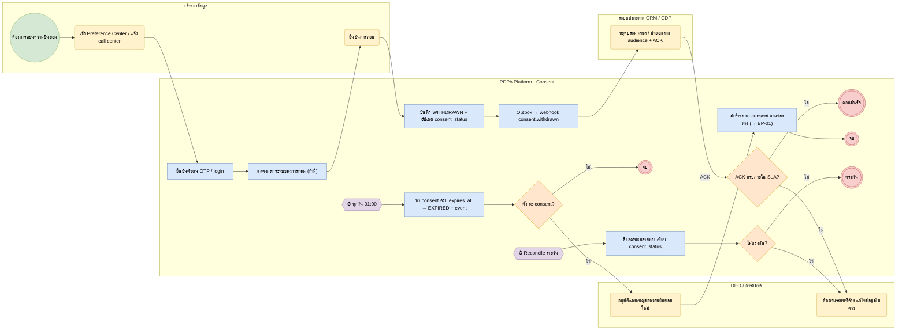

# BP-02 ถอนความยินยอม หมดอายุ และกระทบยอด (Withdrawal, expiry & reconcile)

> Trigger: เจ้าของข้อมูลขอถอน / consent ครบอายุ / งานกระทบยอดรายวัน  
> ผลลัพธ์: สถานะตรงกันทุกระบบ ระบบปลายทางหยุดประมวลผล  
> UC: CON-13, CON-18, CON-19, CON-20, CON-21  
> ต้นฉบับ: `design/PDPA_System_Analysis.drawio` → หน้า **BP-02 ถอนความยินยอม หมดอายุ และกระทบยอด**

## Use case ที่ครอบคลุม

- [CON-13](../modules/CON.md#con-13) ถอนความยินยอม
- [CON-18](../modules/CON.md#con-18) ศูนย์ตั้งค่าความเป็นส่วนตัว
- [CON-19](../modules/CON.md#con-19) ยืนยันตัวตนก่อนบันทึก
- [CON-20](../modules/CON.md#con-20) วันหมดอายุและต่ออายุ
- [CON-21](../modules/CON.md#con-21) ค้นหา แดชบอร์ด และส่งออก

## Diagram

สัญลักษณ์: วงกลม = เริ่ม · วงกลมซ้อน = จบ · สี่เหลี่ยมมุมมน (เหลือง) = งานของคน · สี่เหลี่ยม (ฟ้า) = งานของระบบ · ข้าวหลามตัด = gateway · หกเหลี่ยม ⏱ = timer / เหตุการณ์ตามเวลา

## ขั้นตอน

| # | node | lane | ประเภท | ขั้นตอน | API / ตาราง |
|---|---|---|---|---|---|
| 1 | s1 | เจ้าของข้อมูล | เริ่ม | ต้องการถอนความยินยอม |  |
| 2 | t1 | เจ้าของข้อมูล | งานของคน | เข้า Preference Center / แจ้ง call center |  |
| 3 | t2 | PDPA Platform · Consent | งานของระบบ | ยืนยันตัวตน OTP / login | iam.subject_verifications |
| 4 | t3 | PDPA Platform · Consent | งานของระบบ | แสดงผลกระทบของการถอน (ถ้ามี) |  |
| 5 | t4 | เจ้าของข้อมูล | งานของคน | ยืนยันการถอน |  |
| 6 | t5 | PDPA Platform · Consent | งานของระบบ | บันทึก WITHDRAWN + อัปเดต consent_status | POST /public/v1/consents |
| 7 | t6 | PDPA Platform · Consent | งานของระบบ | Outbox → webhook consent.withdrawn |  |
| 8 | t7 | ระบบปลายทาง CRM / CDP | งานของคน | หยุดประมวลผล / นำออกจาก audience + ACK |  |
| 9 | g1 | PDPA Platform · Consent | gateway | ACK ครบภายใน SLA? |  |
| 10 | e1 | PDPA Platform · Consent | จบ | ถอนสำเร็จ |  |
| 11 | t8 | DPO / การตลาด | งานของคน | ติดตามระบบที่ค้าง แก้ไขข้อมูลไม่ตรง |  |
| 12 | m1 | PDPA Platform · Consent | timer / เหตุการณ์ | ทุกวัน 01:00 |  |
| 13 | t9 | PDPA Platform · Consent | งานของระบบ | หา consent ครบ expires_at → EXPIRED + event | consent.expired |
| 14 | g2 | PDPA Platform · Consent | gateway | ตั้ง re-consent? |  |
| 15 | e2 | PDPA Platform · Consent | จบ | จบ |  |
| 16 | t11 | DPO / การตลาด | งานของคน | อนุมัติแคมเปญขอความยินยอมใหม่ | campaigns |
| 17 | t12 | PDPA Platform · Consent | งานของระบบ | ส่งคำขอ re-consent ตามช่องทาง (→ BP-01) | campaign_recipients |
| 18 | e4 | PDPA Platform · Consent | จบ | จบ |  |
| 19 | m2 | PDPA Platform · Consent | timer / เหตุการณ์ | Reconcile รายวัน |  |
| 20 | t13 | PDPA Platform · Consent | งานของระบบ | ดึงสถานะปลายทาง เทียบ consent_status | reconcile_runs · reconcile_items |
| 21 | g3 | PDPA Platform · Consent | gateway | ไม่ตรงกัน? |  |
| 22 | e3 | PDPA Platform · Consent | จบ | ตรงกัน |  |

### เงื่อนไขบนเส้นทาง

| จาก | เงื่อนไข / ข้อความ | ไป |
|---|---|---|
| t7 · หยุดประมวลผล / นำออกจาก audience + ACK | ACK | g1 · ACK ครบภายใน SLA? |
| g1 · ACK ครบภายใน SLA? | ใช่ | e1 · ถอนสำเร็จ |
| g1 · ACK ครบภายใน SLA? | ไม่ | t8 · ติดตามระบบที่ค้าง แก้ไขข้อมูลไม่ตรง |
| g2 · ตั้ง re-consent? | ใช่ | t11 · อนุมัติแคมเปญขอความยินยอมใหม่ |
| g2 · ตั้ง re-consent? | ไม่ | e2 · จบ |
| g3 · ไม่ตรงกัน? | ใช่ | t8 · ติดตามระบบที่ค้าง แก้ไขข้อมูลไม่ตรง |
| g3 · ไม่ตรงกัน? | ไม่ | e3 · ตรงกัน |

## กฎทางธุรกิจและข้อกำหนดกฎหมาย (ต้องมี test ครอบคลุม)

1. ถอนความยินยอมได้ตลอดเวลา และต้องถอนได้ง่ายเช่นเดียวกับการให้ความยินยอม (ม.19)
2. การถอนไม่กระทบการประมวลผลที่ทำไปแล้วโดยชอบ และต้องแจ้งผลกระทบของการถอนให้เจ้าของข้อมูลทราบ (ม.19)
3. ถอนผ่านช่องทางใดก็ได้ (preference center, call center, API) และมีผลทุกช่องทาง
4. ระบบปลายทางต้อง ACK ภายใน SLA (ค่าเริ่มต้น 24 ชม.) ไม่เช่นนั้นเข้าคิว reconcile และแจ้ง DPO
5. consent ที่หมดอายุถือว่าไม่ได้รับความยินยอม (EXPIRED) จนกว่าจะให้ใหม่

## ข้อมูลที่เกี่ยวข้อง

- [consent.consent_transactions](../data/consent.md#consent-consent-transactions) ⟨P⟩ · [consent.consent_status](../data/consent.md#consent-consent-status)
- [iam.subject_verifications](../data/iam.md#iam-subject-verifications)
- [consent.downstream_syncs](../data/consent.md#consent-downstream-syncs)
- [consent.reconcile_runs](../data/consent.md#consent-reconcile-runs) · [consent.reconcile_items](../data/consent.md#consent-reconcile-items)
- [consent.campaigns](../data/consent.md#consent-campaigns) · [consent.campaign_recipients](../data/consent.md#consent-campaign-recipients)

## API / event / job

- POST /public/v1/otp/send · /verify
- GET /public/v1/preferences (session ของ portal)
- event: consent.withdrawn · consent.expired
- event: consent.mismatch_found
- job: consent.expiry_sweep · consent.reconcile (River)
