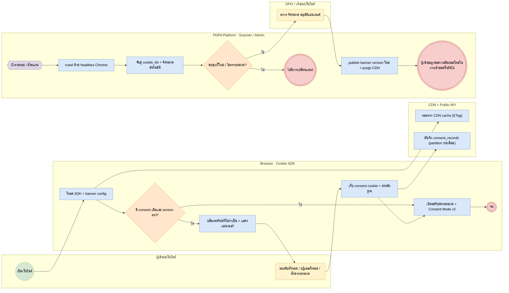

# BP-03 แบนเนอร์คุกกี้และการสแกนเว็บไซต์ (Cookie consent & scanning)

> Trigger: ผู้เข้าชมเปิดเว็บไซต์ / รอบสแกนตามกำหนด  
> ผลลัพธ์: บล็อกสคริปต์จนกว่าจะยินยอม บันทึกหลักฐาน และแบนเนอร์ตรงกับคุกกี้จริง  
> UC: CON-01 ถึง CON-08  
> ต้นฉบับ: `design/PDPA_System_Analysis.drawio` → หน้า **BP-03 แบนเนอร์คุกกี้และการสแกนเว็บไซต์**

## Use case ที่ครอบคลุม

- [CON-01](../modules/CON.md#con-01) แบนเนอร์คุกกี้บนเว็บไซต์
- [CON-02](../modules/CON.md#con-02) ตั้งค่าคุกกี้รายหมวด
- [CON-03](../modules/CON.md#con-03) บล็อกสคริปต์ก่อนได้รับความยินยอม
- [CON-04](../modules/CON.md#con-04) สแกนและจัดหมวดคุกกี้อัตโนมัติ
- [CON-05](../modules/CON.md#con-05) นโยบายคุกกี้อัตโนมัติ
- [CON-06](../modules/CON.md#con-06) ปรับแต่งดีไซน์และหลายภาษา
- [CON-07](../modules/CON.md#con-07) หลายโดเมนและ Mobile SDK
- [CON-08](../modules/CON.md#con-08) A/B testing และวัด consent rate

## Diagram

สัญลักษณ์: วงกลม = เริ่ม · วงกลมซ้อน = จบ · สี่เหลี่ยมมุมมน (เหลือง) = งานของคน · สี่เหลี่ยม (ฟ้า) = งานของระบบ · ข้าวหลามตัด = gateway · หกเหลี่ยม ⏱ = timer / เหตุการณ์ตามเวลา

## ขั้นตอน

| # | node | lane | ประเภท | ขั้นตอน | API / ตาราง |
|---|---|---|---|---|---|
| 1 | s | ผู้เข้าชมเว็บไซต์ | เริ่ม | เปิดเว็บไซต์ |  |
| 2 | t1 | Browser · Cookie SDK | งานของระบบ | โหลด SDK + banner config | GET /public/v1/cookie/banners/{domainKey} |
| 3 | t1b | CDN + Public API | งานของระบบ | ตอบจาก CDN cache (ETag) |  |
| 4 | g1 | Browser · Cookie SDK | gateway | มี consent เดิมและ version ตรง? |  |
| 5 | t2 | Browser · Cookie SDK | งานของระบบ | บล็อกสคริปต์ที่ไม่จำเป็น + แสดงแบนเนอร์ |  |
| 6 | t3 | ผู้เข้าชมเว็บไซต์ | งานของคน | ยอมรับทั้งหมด / ปฏิเสธทั้งหมด / ตั้งค่ารายหมวด |  |
| 7 | t4 | Browser · Cookie SDK | งานของระบบ | เก็บ consent cookie + ส่งหลักฐาน |  |
| 8 | t5 | CDN + Public API | งานของระบบ | บันทึก consent_records (partition รายเดือน) | POST /public/v1/cookie/consents |
| 9 | t6 | Browser · Cookie SDK | งานของระบบ | เปิดสคริปต์ตามหมวด + Consent Mode v2 |  |
| 10 | e1 | Browser · Cookie SDK | จบ | จบ |  |
| 11 | m1 | PDPA Platform · Scanner / Admin | timer / เหตุการณ์ | ตามรอบ / สั่งสแกน |  |
| 12 | t7 | PDPA Platform · Scanner / Admin | งานของระบบ | crawl ด้วย headless Chrome | scanner (chromedp) · cookie.scans |
| 13 | t8 | PDPA Platform · Scanner / Admin | งานของระบบ | จับคู่ cookie_kb + จัดหมวดอัตโนมัติ | scan_findings |
| 14 | g2 | PDPA Platform · Scanner / Admin | gateway | พบคุกกี้ใหม่ / ไม่ทราบหมวด? |  |
| 15 | t9 | DPO / เจ้าของเว็บไซต์ | งานของคน | ตรวจ จัดหมวด อนุมัติแบนเนอร์ |  |
| 16 | e2 | PDPA Platform · Scanner / Admin | จบ | ไม่มีการเปลี่ยนแปลง |  |
| 17 | t10 | PDPA Platform · Scanner / Admin | งานของระบบ | publish banner version ใหม่ + purge CDN | banner_configs |
| 18 | x1 | PDPA Platform · Scanner / Admin | จบ (ส่งข้อความ) | ผู้เข้าชมถูกขอความยินยอมใหม่ในการเข้าชมครั้งถัดไป |  |

### เงื่อนไขบนเส้นทาง

| จาก | เงื่อนไข / ข้อความ | ไป |
|---|---|---|
| g1 · มี consent เดิมและ version ตรง? | ไม่ | t2 · บล็อกสคริปต์ที่ไม่จำเป็น + แสดงแบนเนอร์ |
| g1 · มี consent เดิมและ version ตรง? | ใช่ | t6 · เปิดสคริปต์ตามหมวด + Consent Mode v2 |
| g2 · พบคุกกี้ใหม่ / ไม่ทราบหมวด? | ใช่ | t9 · ตรวจ จัดหมวด อนุมัติแบนเนอร์ |
| g2 · พบคุกกี้ใหม่ / ไม่ทราบหมวด? | ไม่ | e2 · ไม่มีการเปลี่ยนแปลง |

## กฎทางธุรกิจและข้อกำหนดกฎหมาย (ต้องมี test ครอบคลุม)

1. คุกกี้ที่จำเป็น (strictly necessary) ไม่ต้องขอความยินยอม หมวดอื่นต้องบล็อกไว้จนกว่าจะได้รับความยินยอม (prior blocking)
2. ปุ่มปฏิเสธทั้งหมดต้องเห็นชัดเท่ากับปุ่มยอมรับทั้งหมด และไม่ใช้ dark pattern (แนวปฏิบัติที่ดี)
3. เพิ่มคุกกี้ใหม่หรือเปลี่ยนหมวด → banner version ใหม่ → ขอความยินยอมใหม่
4. หลักฐานเก็บ: domain, banner version, หมวดที่เลือก, เวลา, hash ของ IP / User-Agent (ไม่เก็บ IP เต็มถ้าไม่จำเป็น)
5. อายุ consent cookie ตั้งได้ต่อโดเมน (ค่าเริ่มต้น 12 เดือน) — หมดอายุแล้วแสดงแบนเนอร์ใหม่

## ข้อมูลที่เกี่ยวข้อง

- [cookie.domains](../data/cookie.md#cookie-domains) · [cookie.apps](../data/cookie.md#cookie-apps) · [cookie.banner_configs](../data/cookie.md#cookie-banner-configs) · [cookie.ab_variants](../data/cookie.md#cookie-ab-variants)
- [cookie.categories](../data/cookie.md#cookie-categories) · [cookie.cookies](../data/cookie.md#cookie-cookies) · [cookie.cookie_kb](../data/cookie.md#cookie-cookie-kb) · [cookie.script_rules](../data/cookie.md#cookie-script-rules)
- [cookie.scans](../data/cookie.md#cookie-scans) · [cookie.scan_findings](../data/cookie.md#cookie-scan-findings)
- [cookie.consent_records](../data/cookie.md#cookie-consent-records) ⟨P⟩

## API / event / job

- GET /public/v1/cookie/banners/{domainKey} (CDN cache 5 นาที)
- POST /public/v1/cookie/consents (rate limit ต่อ IP)
- POST /admin/v1/cookie/domains/{id}/scans
- event: cookie.scan_completed · cookie.banner_published
