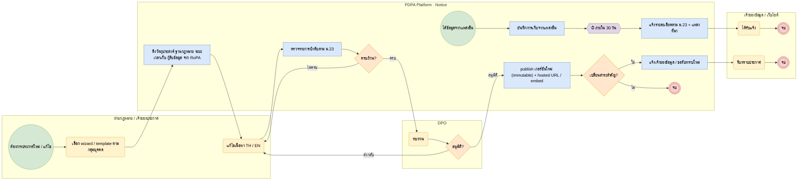

# BP-04 จัดทำและเผยแพร่ประกาศความเป็นส่วนตัว (Privacy notice lifecycle)

> Trigger: ประกาศใหม่ / แก้ไขประกาศ / เก็บข้อมูลจากแหล่งอื่น  
> ผลลัพธ์: ประกาศเวอร์ชันที่อนุมัติแล้ว เผยแพร่ และมีหลักฐานการแจ้ง  
> UC: PNG-01 ถึง PNG-16  
> ต้นฉบับ: `design/PDPA_System_Analysis.drawio` → หน้า **BP-04 จัดทำและเผยแพร่ประกาศความเป็นส่วนตัว**

## Use case ที่ครอบคลุม

- [PNG-01](../modules/PNG.md#png-01) สร้างประกาศแบบถาม-ตอบ
- [PNG-02](../modules/PNG.md#png-02) ตรวจเนื้อหาครบตาม ม.23
- [PNG-03](../modules/PNG.md#png-03) แม่แบบตามกลุ่มเจ้าของข้อมูล
- [PNG-04](../modules/PNG.md#png-04) ประกาศกรณีเก็บจากแหล่งอื่น
- [PNG-05](../modules/PNG.md#png-05) ประกาศสองภาษา
- [PNG-06](../modules/PNG.md#png-06) จัดการเวอร์ชัน
- [PNG-07](../modules/PNG.md#png-07) แจ้งการเปลี่ยนแปลงและขอความยินยอมใหม่
- [PNG-08](../modules/PNG.md#png-08) เผยแพร่และฝังในระบบ
- [PNG-09](../modules/PNG.md#png-09) บันทึกการรับทราบ
- [PNG-10](../modules/PNG.md#png-10) ดึงเนื้อหาจาก RoPA
- [PNG-11](../modules/PNG.md#png-11) แม่แบบตามอุตสาหกรรม
- [PNG-12](../modules/PNG.md#png-12) ประกาศแบบหลายชั้นและป้าย CCTV
- [PNG-13](../modules/PNG.md#png-13) ลิงก์เอกสารอ้างอิงในประกาศ
- [PNG-14](../modules/PNG.md#png-14) อนุมัติก่อนเผยแพร่
- [PNG-15](../modules/PNG.md#png-15) แจ้งเตือนทบทวนตามรอบ
- [PNG-16](../modules/PNG.md#png-16) สร้างนโยบายความเป็นส่วนตัวและนโยบายคุกกี้

## Diagram

สัญลักษณ์: วงกลม = เริ่ม · วงกลมซ้อน = จบ · สี่เหลี่ยมมุมมน (เหลือง) = งานของคน · สี่เหลี่ยม (ฟ้า) = งานของระบบ · ข้าวหลามตัด = gateway · หกเหลี่ยม ⏱ = timer / เหตุการณ์ตามเวลา

## ขั้นตอน

| # | node | lane | ประเภท | ขั้นตอน | API / ตาราง |
|---|---|---|---|---|---|
| 1 | s | ฝ่ายกฎหมาย / เจ้าของประกาศ | เริ่ม | ต้องการประกาศใหม่ / แก้ไข |  |
| 2 | t1 | ฝ่ายกฎหมาย / เจ้าของประกาศ | งานของคน | เลือก wizard / template ตามกลุ่มบุคคล |  |
| 3 | t2 | PDPA Platform · Notice | งานของระบบ | ดึงวัตถุประสงค์ ฐานกฎหมาย ระยะเวลาเก็บ ผู้รับข้อมูล จาก RoPA | notice_activity_links |
| 4 | t3 | ฝ่ายกฎหมาย / เจ้าของประกาศ | งานของคน | แก้ไขเนื้อหา TH / EN |  |
| 5 | t4 | PDPA Platform · Notice | งานของระบบ | ตรวจรายการบังคับตาม ม.23 |  |
| 6 | g1 | PDPA Platform · Notice | gateway | ครบถ้วน? |  |
| 7 | t5 | DPO | งานของคน | ทบทวน |  |
| 8 | g2 | DPO | gateway | อนุมัติ? |  |
| 9 | t6 | PDPA Platform · Notice | งานของระบบ | publish เวอร์ชันใหม่ (immutable) + hosted URL / embed | notice_versions · embeds |
| 10 | g3 | PDPA Platform · Notice | gateway | เปลี่ยนสาระสำคัญ? |  |
| 11 | t7 | PDPA Platform · Notice | งานของระบบ | แจ้งเจ้าของข้อมูล / ขอรับทราบใหม่ |  |
| 12 | t8 | เจ้าของข้อมูล / เว็บไซต์ | งานของคน | รับทราบประกาศ | acknowledgements |
| 13 | e1 | เจ้าของข้อมูล / เว็บไซต์ | จบ | จบ |  |
| 14 | e0 | PDPA Platform · Notice | จบ | จบ |  |
| 15 | s2 | PDPA Platform · Notice | เริ่ม | ได้ข้อมูลจากแหล่งอื่น |  |
| 16 | t9 | PDPA Platform · Notice | งานของระบบ | บันทึกการเก็บจากแหล่งอื่น | indirect_collections |
| 17 | m1 | PDPA Platform · Notice | timer / เหตุการณ์ | ภายใน 30 วัน |  |
| 18 | t10 | PDPA Platform · Notice | งานของระบบ | แจ้งรายละเอียดตาม ม.23 + แหล่งที่มา |  |
| 19 | t11 | เจ้าของข้อมูล / เว็บไซต์ | งานของคน | ได้รับแจ้ง |  |
| 20 | e2 | เจ้าของข้อมูล / เว็บไซต์ | จบ | จบ |  |

### เงื่อนไขบนเส้นทาง

| จาก | เงื่อนไข / ข้อความ | ไป |
|---|---|---|
| g1 · ครบถ้วน? | ไม่ครบ | t3 · แก้ไขเนื้อหา TH / EN |
| g1 · ครบถ้วน? | ครบ | t5 · ทบทวน |
| g2 · อนุมัติ? | ส่งกลับ | t3 · แก้ไขเนื้อหา TH / EN |
| g2 · อนุมัติ? | อนุมัติ | t6 · publish เวอร์ชันใหม่ (immutable) + hosted URL / embed |
| g3 · เปลี่ยนสาระสำคัญ? | ใช่ | t7 · แจ้งเจ้าของข้อมูล / ขอรับทราบใหม่ |
| g3 · เปลี่ยนสาระสำคัญ? | ไม่ | e0 · จบ |

## กฎทางธุรกิจและข้อกำหนดกฎหมาย (ต้องมี test ครอบคลุม)

1. แจ้งก่อนหรือขณะเก็บข้อมูล: วัตถุประสงค์และฐานกฎหมาย, ผลกระทบกรณีไม่ให้ข้อมูลที่จำเป็นตามกฎหมาย/สัญญา, ข้อมูลที่เก็บและระยะเวลาเก็บ, ผู้รับข้อมูล, ข้อมูลติดต่อผู้ควบคุมข้อมูลและ DPO, สิทธิของเจ้าของข้อมูล (ม.23)
2. เก็บข้อมูลจากแหล่งอื่นต้องแจ้งเจ้าของข้อมูลภายใน 30 วันนับแต่วันที่เก็บ (ม.25) เว้นแต่เข้าข้อยกเว้น
3. ใช้ข้อมูลเพื่อวัตถุประสงค์ใหม่ต้องแจ้งและขอความยินยอมก่อน เว้นแต่มีฐานอื่นตามกฎหมาย (ม.21)
4. ทุกเวอร์ชันแก้ไขไม่ได้หลัง publish; เก็บหลักฐานว่าแสดงเวอร์ชันใดแก่ใคร เมื่อใด
5. ประกาศต้องมีภาษาไทยเป็นอย่างน้อย และแสดงวันที่มีผลบังคับ

## ข้อมูลที่เกี่ยวข้อง

- [notice.notices](../data/notice.md#notice-notices) · [notice.notice_versions](../data/notice.md#notice-notice-versions)
- [notice.notice_activity_links](../data/notice.md#notice-notice-activity-links) → ropa.processing_activities
- [notice.acknowledgements](../data/notice.md#notice-acknowledgements) · [notice.embeds](../data/notice.md#notice-embeds) · [notice.linked_documents](../data/notice.md#notice-linked-documents)
- [notice.indirect_collections](../data/notice.md#notice-indirect-collections) · [notice.wizard_templates](../data/notice.md#notice-wizard-templates)

## API / event / job

- GET /public/v1/notices/{slug} (hosted / embed)
- POST /public/v1/notices/{id}/acknowledgements
- event: notice.published · notice.material_change
- job: notice.indirect_due (แจ้งเตือนก่อนครบ 30 วัน)
