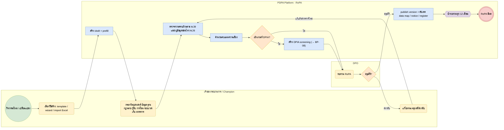

# BP-05 จัดทำและอนุมัติ RoPA (Record of Processing Activities)

> Trigger: กิจกรรมใหม่ / เปลี่ยนระบบ ผู้รับข้อมูล หรือการโอน / รอบทบทวนประจำปี  
> ผลลัพธ์: RoPA ที่อนุมัติ เชื่อมกับ data map, notice, risk และ DPIA  
> UC: ROPA-01 ถึง ROPA-20, RTG-04 ถึง RTG-07  
> ต้นฉบับ: `design/PDPA_System_Analysis.drawio` → หน้า **BP-05 จัดทำและอนุมัติ RoPA**

## Use case ที่ครอบคลุม

- [ROPA-01](../modules/ROPA.md#ropa-01) ทะเบียนข้อมูลส่วนบุคคล
- [ROPA-02](../modules/ROPA.md#ropa-02) ทะเบียนระบบและทรัพย์สิน
- [ROPA-03](../modules/ROPA.md#ropa-03) RoPA ของผู้ควบคุมข้อมูล
- [ROPA-04](../modules/ROPA.md#ropa-04) RoPA ของผู้ประมวลผลข้อมูล
- [ROPA-05](../modules/ROPA.md#ropa-05) เพิ่มกิจกรรมแบบปกติและแบบมาตรฐาน
- [ROPA-06](../modules/ROPA.md#ropa-06) ฐานกฎหมายต่อวัตถุประสงค์
- [ROPA-07](../modules/ROPA.md#ropa-07) ระยะเวลาเก็บรักษาและวิธีทำลาย
- [ROPA-08](../modules/ROPA.md#ropa-08) ผู้รับข้อมูลและการโอนต่างประเทศ
- [ROPA-09](../modules/ROPA.md#ropa-09) มาตรการความปลอดภัยต่อกิจกรรม
- [ROPA-10](../modules/ROPA.md#ropa-10) บันทึกการปฏิเสธคำขอใช้สิทธิ
- [ROPA-11](../modules/ROPA.md#ropa-11) แบบสอบถามเก็บข้อมูลจากหน่วยงาน
- [ROPA-12](../modules/ROPA.md#ropa-12) ถาม-ตอบกับ DPO หรือที่ปรึกษา
- [ROPA-13](../modules/ROPA.md#ropa-13) เวอร์ชันและการอนุมัติ
- [ROPA-14](../modules/ROPA.md#ropa-14) วงจรชีวิตของกิจกรรม
- [ROPA-15](../modules/ROPA.md#ropa-15) แจ้งเตือนทบทวน RoPA ตามรอบ
- [ROPA-16](../modules/ROPA.md#ropa-16) ออกรายงาน RoPA
- [ROPA-17](../modules/ROPA.md#ropa-17) แดชบอร์ด RoPA
- [ROPA-18](../modules/ROPA.md#ropa-18) นำเข้า RoPA จาก Excel เดิม
- [ROPA-19](../modules/ROPA.md#ropa-19) เชื่อม RoPA กับโมดูลอื่น
- [ROPA-20](../modules/ROPA.md#ropa-20) ตรวจสิทธิ์ยกเว้นกิจการขนาดเล็ก
- [RTG-04](../modules/RTG.md#rtg-04) สร้าง RoPA จาก template ในไม่กี่ขั้นตอน
- [RTG-05](../modules/RTG.md#rtg-05) Wizard ถาม-ตอบภาษาง่าย
- [RTG-06](../modules/RTG.md#rtg-06) ค่าแนะนำพร้อมเหตุผล
- [RTG-07](../modules/RTG.md#rtg-07) สร้าง RoPA ผู้ประมวลผลจาก template

## Diagram

สัญลักษณ์: วงกลม = เริ่ม · วงกลมซ้อน = จบ · สี่เหลี่ยมมุมมน (เหลือง) = งานของคน · สี่เหลี่ยม (ฟ้า) = งานของระบบ · ข้าวหลามตัด = gateway · หกเหลี่ยม ⏱ = timer / เหตุการณ์ตามเวลา

## ขั้นตอน

| # | node | lane | ประเภท | ขั้นตอน | API / ตาราง |
|---|---|---|---|---|---|
| 1 | s | เจ้าของกระบวนการ / Champion | เริ่ม | กิจกรรมใหม่ / เปลี่ยนแปลง |  |
| 2 | t1 | เจ้าของกระบวนการ / Champion | งานของคน | เลือกวิธีสร้าง: template / wizard / import Excel |  |
| 3 | t2 | PDPA Platform · RoPA | งานของระบบ | สร้าง draft + prefill | generation_runs · wizard_sessions |
| 4 | t3 | เจ้าของกระบวนการ / Champion | งานของคน | กรอกวัตถุประสงค์ ข้อมูล ฐานกฎหมาย ผู้รับ การโอน ระยะเวลาเก็บ มาตรการ |  |
| 5 | t4 | PDPA Platform · RoPA | งานของระบบ | ตรวจความครบถ้วนตาม ม.39 และกฎข้อมูลอ่อนไหว ม.26 |  |
| 6 | t5 | PDPA Platform · RoPA | งานของระบบ | คำนวณคะแนนความเสี่ยง | risk.activity_scores |
| 7 | g1 | PDPA Platform · RoPA | gateway | เข้าเกณฑ์ DPIA? |  |
| 8 | t6 | PDPA Platform · RoPA | งานของระบบ | สร้าง DPIA screening (→ BP-08) | assess.assessments |
| 9 | t7 | DPO | งานของคน | ทบทวน RoPA |  |
| 10 | g2 | DPO | gateway | อนุมัติ? |  |
| 11 | t8 | เจ้าของกระบวนการ / Champion | งานของคน | แก้ไขตามเหตุผลที่ส่งกลับ | activity_rejections |
| 12 | t9 | PDPA Platform · RoPA | งานของระบบ | publish version + อัปเดต data map / notice / register | record_versions · dataflow.snapshots |
| 13 | m1 | PDPA Platform · RoPA | timer / เหตุการณ์ | ทบทวนทุก 12 เดือน |  |
| 14 | e | PDPA Platform · RoPA | จบ | RoPA มีผล |  |

### เงื่อนไขบนเส้นทาง

| จาก | เงื่อนไข / ข้อความ | ไป |
|---|---|---|
| g1 · เข้าเกณฑ์ DPIA? | ไม่ | t7 · ทบทวน RoPA |
| g1 · เข้าเกณฑ์ DPIA? | ใช่ | t6 · สร้าง DPIA screening (→ BP-08) |
| g2 · อนุมัติ? | อนุมัติ | t9 · publish version + อัปเดต data map / notice / register |
| g2 · อนุมัติ? | ส่งกลับ | t8 · แก้ไขตามเหตุผลที่ส่งกลับ |
| t8 · แก้ไขตามเหตุผลที่ส่งกลับ | แก้แล้วส่งตรวจใหม่ | t4 · ตรวจความครบถ้วนตาม ม.39 และกฎข้อมูลอ่อนไหว ม.26 |

## กฎทางธุรกิจและข้อกำหนดกฎหมาย (ต้องมี test ครอบคลุม)

1. RoPA ต้องมีอย่างน้อย: ข้อมูลที่เก็บ, วัตถุประสงค์, ข้อมูลผู้ควบคุมข้อมูล, ระยะเวลาเก็บ, สิทธิและวิธีเข้าถึง, การใช้/เปิดเผยตาม ม.27, การปฏิเสธคำขอหรือคัดค้าน, มาตรการรักษาความปลอดภัย (ม.39)
2. ข้อมูลอ่อนไหวต้องระบุข้อยกเว้นตาม ม.26 หรือความยินยอมโดยชัดแจ้ง ไม่เช่นนั้นส่งอนุมัติไม่ได้
3. กิจการขนาดเล็กอาจได้รับยกเว้นบางรายการตามประกาศ สคส. (บันทึกผลตรวจใน sme_exemption_checks)
4. ผู้ประมวลผลจัดทำบันทึกรายการตามประกาศ สคส. ว่าด้วยบันทึกรายการของผู้ประมวลผล
5. ทุกการแก้ไขสร้าง record_versions + audit log; ทบทวนอย่างน้อยปีละครั้ง (นโยบาย)

## ข้อมูลที่เกี่ยวข้อง

- [ropa.processing_activities](../data/ropa.md#ropa-processing-activities) · [ropa.activity_purposes](../data/ropa.md#ropa-activity-purposes) · [ropa.activity_data](../data/ropa.md#ropa-activity-data)
- [ropa.activity_systems](../data/ropa.md#ropa-activity-systems) · [ropa.activity_recipients](../data/ropa.md#ropa-activity-recipients) · [ropa.activity_transfers](../data/ropa.md#ropa-activity-transfers)
- [ropa.retention_rules](../data/ropa.md#ropa-retention-rules) · [ropa.activity_controls](../data/ropa.md#ropa-activity-controls) · [ropa.activity_rejections](../data/ropa.md#ropa-activity-rejections)
- [ropa.template_sets](../data/ropa.md#ropa-template-sets) · [ropa.activity_templates](../data/ropa.md#ropa-activity-templates) · [ropa.generation_runs](../data/ropa.md#ropa-generation-runs) · [ropa.wizard_sessions](../data/ropa.md#ropa-wizard-sessions)
- [risk.activity_scores](../data/risk.md#risk-activity-scores) · [platform.record_versions](../data/platform.md#platform-record-versions) · [platform.approvals](../data/platform.md#platform-approvals)

## API / event / job

- POST /admin/v1/ropa/activities · PATCH …/{id}
- POST /admin/v1/ropa/activities/{id}/submit · /approve · /reject
- POST /admin/v1/ropa/imports (Excel)
- event: ropa.activity_submitted · ropa.activity_approved · risk.dpia_required
