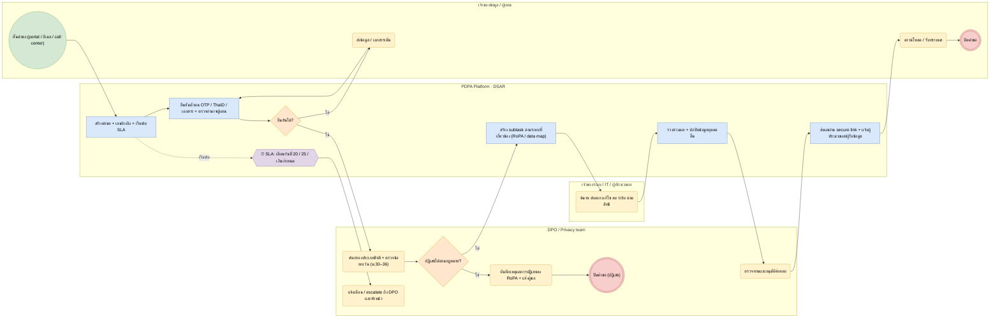

# BP-06 จัดการคำขอใช้สิทธิของเจ้าของข้อมูล (DSAR)

> Trigger: เจ้าของข้อมูลหรือผู้แทนยื่นคำขอ (เข้าถึง โอนย้าย คัดค้าน ลบ ระงับ แก้ไข ถอนความยินยอม)  
> ผลลัพธ์: ตอบภายใน SLA พร้อมหลักฐาน  
> UC: DSAR-01 ถึง DSAR-21  
> ต้นฉบับ: `design/PDPA_System_Analysis.drawio` → หน้า **BP-06 จัดการคำขอใช้สิทธิของเจ้าของข้อมูล**

## Use case ที่ครอบคลุม

- [DSAR-01](../modules/DSAR.md#dsar-01) แบบฟอร์มขอใช้สิทธิออนไลน์
- [DSAR-02](../modules/DSAR.md#dsar-02) รับคำขอหลายช่องทาง
- [DSAR-03](../modules/DSAR.md#dsar-03) ครอบคลุมสิทธิทุกประเภท
- [DSAR-04](../modules/DSAR.md#dsar-04) ยื่นคำขอแทนเจ้าของข้อมูล
- [DSAR-05](../modules/DSAR.md#dsar-05) รับเรื่องร้องเรียนและสอบถาม
- [DSAR-06](../modules/DSAR.md#dsar-06) ยืนยันตัวตนผู้ยื่นคำขอ
- [DSAR-07](../modules/DSAR.md#dsar-07) นับเวลา SLA 30 วัน
- [DSAR-08](../modules/DSAR.md#dsar-08) Workflow และงานย่อย
- [DSAR-09](../modules/DSAR.md#dsar-09) ค้นหาข้อมูลของเจ้าของข้อมูลข้ามระบบ
- [DSAR-10](../modules/DSAR.md#dsar-10) ตรวจข้อยกเว้นก่อนลบข้อมูล
- [DSAR-11](../modules/DSAR.md#dsar-11) ปฏิเสธคำขอพร้อมเหตุผล
- [DSAR-12](../modules/DSAR.md#dsar-12) แจ้งผู้รับข้อมูลให้ดำเนินการตาม
- [DSAR-13](../modules/DSAR.md#dsar-13) template หนังสือตอบกลับ
- [DSAR-14](../modules/DSAR.md#dsar-14) ส่งข้อมูลให้เจ้าของข้อมูลอย่างปลอดภัย
- [DSAR-15](../modules/DSAR.md#dsar-15) ส่งออกข้อมูลแบบอ่านได้ด้วยเครื่อง
- [DSAR-16](../modules/DSAR.md#dsar-16) ปกปิดข้อมูลของบุคคลอื่น
- [DSAR-17](../modules/DSAR.md#dsar-17) ประวัติและสืบค้นคำขอ
- [DSAR-18](../modules/DSAR.md#dsar-18) รายงานและแดชบอร์ดคำขอ
- [DSAR-19](../modules/DSAR.md#dsar-19) พอร์ทัลติดตามสถานะสำหรับผู้ยื่น
- [DSAR-20](../modules/DSAR.md#dsar-20) ตั้งค่า workflow แยกตามประเภทสิทธิ
- [DSAR-21](../modules/DSAR.md#dsar-21) เชื่อมกับระบบ Consent

## Diagram

สัญลักษณ์: วงกลม = เริ่ม · วงกลมซ้อน = จบ · สี่เหลี่ยมมุมมน (เหลือง) = งานของคน · สี่เหลี่ยม (ฟ้า) = งานของระบบ · ข้าวหลามตัด = gateway · หกเหลี่ยม ⏱ = timer / เหตุการณ์ตามเวลา

## ขั้นตอน

| # | node | lane | ประเภท | ขั้นตอน | API / ตาราง |
|---|---|---|---|---|---|
| 1 | s | เจ้าของข้อมูล / ผู้แทน | เริ่ม | ยื่นคำขอ (portal / อีเมล / call center) |  |
| 2 | t1 | PDPA Platform · DSAR | งานของระบบ | สร้างคำขอ + เลขอ้างอิง + เริ่มนับ SLA | POST /public/v1/dsar-requests |
| 3 | t2 | PDPA Platform · DSAR | งานของระบบ | ยืนยันตัวตน OTP / ThaID / เอกสาร + ตรวจอำนาจผู้แทน | verifications |
| 4 | g1 | PDPA Platform · DSAR | gateway | ยืนยันได้? |  |
| 5 | t3 | เจ้าของข้อมูล / ผู้แทน | งานของคน | ส่งข้อมูล / เอกสารเพิ่ม |  |
| 6 | t4 | DPO / Privacy team | งานของคน | คัดกรองประเภทสิทธิ + ตรวจข้อยกเว้น (ม.30–36) | exemption_checks · legal_holds |
| 7 | g2 | DPO / Privacy team | gateway | ปฏิเสธได้ตามกฎหมาย? |  |
| 8 | t5 | DPO / Privacy team | งานของคน | บันทึกเหตุผลการปฏิเสธลง RoPA + แจ้งผู้ขอ |  |
| 9 | e2 | DPO / Privacy team | จบ | ปิดคำขอ (ปฏิเสธ) |  |
| 10 | t6 | PDPA Platform · DSAR | งานของระบบ | สร้าง subtask ตามระบบที่เกี่ยวข้อง (RoPA / data map) | subtasks |
| 11 | t7 | เจ้าของระบบ / IT / ผู้ประมวลผล | งานของคน | ค้นหา ส่งออก แก้ไข ลบ ระงับ ตามสิทธิ | search_results |
| 12 | t8 | PDPA Platform · DSAR | งานของระบบ | รวบรวมผล + ปกปิดข้อมูลบุคคลอื่น | packages · redactions |
| 13 | t9 | DPO / Privacy team | งานของคน | ตรวจทานและอนุมัติคำตอบ |  |
| 14 | t10 | PDPA Platform · DSAR | งานของระบบ | ส่งผลผ่าน secure link + แจ้งผู้ประมวลผล/ผู้รับข้อมูล | communications · downstream_notices |
| 15 | t11 | เจ้าของข้อมูล / ผู้แทน | งานของคน | ดาวน์โหลด / รับทราบผล |  |
| 16 | e | เจ้าของข้อมูล / ผู้แทน | จบ | ปิดคำขอ |  |
| 17 | m1 | PDPA Platform · DSAR | timer / เหตุการณ์ | SLA: เตือนวันที่ 20 / 25 / เกินกำหนด |  |
| 18 | t12 | DPO / Privacy team | งานของคน | แจ้งเตือน / escalate ถึง DPO และหัวหน้า |  |

### เงื่อนไขบนเส้นทาง

| จาก | เงื่อนไข / ข้อความ | ไป |
|---|---|---|
| g1 · ยืนยันได้? | ไม่ | t3 · ส่งข้อมูล / เอกสารเพิ่ม |
| g1 · ยืนยันได้? | ใช่ | t4 · คัดกรองประเภทสิทธิ + ตรวจข้อยกเว้น (ม.30–36) |
| g2 · ปฏิเสธได้ตามกฎหมาย? | ไม่ | t6 · สร้าง subtask ตามระบบที่เกี่ยวข้อง (RoPA / data map) |
| g2 · ปฏิเสธได้ตามกฎหมาย? | ใช่ | t5 · บันทึกเหตุผลการปฏิเสธลง RoPA + แจ้งผู้ขอ |
| t1 · สร้างคำขอ + เลขอ้างอิง + เริ่มนับ SLA | เริ่มนับ | m1 · SLA: เตือนวันที่ 20 / 25 / เกินกำหนด |

## กฎทางธุรกิจและข้อกำหนดกฎหมาย (ต้องมี test ครอบคลุม)

1. สิทธิเข้าถึงและขอรับสำเนา: ดำเนินการโดยไม่ชักช้า ไม่เกิน 30 วันนับแต่ได้รับคำขอ (ม.30); สิทธิอื่นใช้ SLA 30 วันเป็นค่าเริ่มต้นตามนโยบาย (ตั้งได้ต่อ request_type)
2. ปฏิเสธได้เฉพาะเหตุตามกฎหมาย และต้องบันทึกการปฏิเสธพร้อมเหตุผลใน RoPA (ม.39)
3. ต้องยืนยันตัวตนก่อนเปิดเผยข้อมูล; ผู้แทนต้องแสดงหลักฐานอำนาจ; ปกปิดข้อมูลของบุคคลอื่นในผลลัพธ์
4. legal hold ระงับการลบ/ทำลาย; แจ้งผู้ประมวลผลให้ดำเนินการตามคำขอตามข้อตกลง (ม.40)
5. ทุกการสื่อสารกับผู้ขอเก็บใน communications (หลักฐาน) และลิงก์ดาวน์โหลดหมดอายุ (ค่าเริ่มต้น 7 วัน)

## ข้อมูลที่เกี่ยวข้อง

- [dsar.requests](../data/dsar.md#dsar-requests) · [dsar.request_types](../data/dsar.md#dsar-request-types) · [dsar.agents](../data/dsar.md#dsar-agents) · [dsar.verifications](../data/dsar.md#dsar-verifications)
- [dsar.subtasks](../data/dsar.md#dsar-subtasks) · [dsar.search_results](../data/dsar.md#dsar-search-results) · [dsar.exemption_checks](../data/dsar.md#dsar-exemption-checks) · [dsar.legal_holds](../data/dsar.md#dsar-legal-holds)
- [dsar.packages](../data/dsar.md#dsar-packages) · [dsar.redactions](../data/dsar.md#dsar-redactions) · [dsar.communications](../data/dsar.md#dsar-communications) · [dsar.downstream_notices](../data/dsar.md#dsar-downstream-notices)
- [iam.subject_verifications](../data/iam.md#iam-subject-verifications) · [platform.sla_timers](../data/platform.md#platform-sla-timers)

## API / event / job

- POST /public/v1/dsar-requests · GET …/{ref}/status
- POST /api/v1/dsar/requests (ช่องทางหน้าร้าน / CRM)
- event: dsar.created · dsar.verified · dsar.sla_warning · dsar.completed · dsar.rejected
- webhook: dsar.subtask_assigned → ระบบ ITSM
