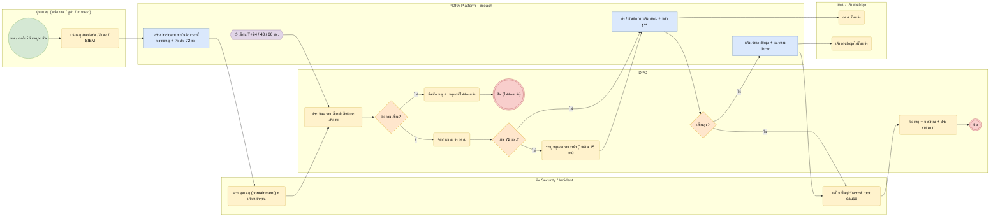

# BP-07 จัดการและแจ้งเหตุละเมิดข้อมูลส่วนบุคคล (Data breach 72 ชม.)

> Trigger: ผู้พบเหตุแจ้ง / SIEM ส่ง alert / ผู้ประมวลผลแจ้ง  
> ผลลัพธ์: ควบคุมเหตุ แจ้ง สคส. และเจ้าของข้อมูลตามเกณฑ์ พร้อมหลักฐานครบ  
> UC: BRE-01 ถึง BRE-17  
> ต้นฉบับ: `design/PDPA_System_Analysis.drawio` → หน้า **BP-07 จัดการและแจ้งเหตุละเมิดข้อมูลส่วนบุคคล**

## Use case ที่ครอบคลุม

- [BRE-01](../modules/BRE.md#bre-01) แบบฟอร์มแจ้งเหตุ
- [BRE-02](../modules/BRE.md#bre-02) ทะเบียนเหตุละเมิด
- [BRE-03](../modules/BRE.md#bre-03) รับแจ้งเหตุจากผู้ประมวลผล
- [BRE-04](../modules/BRE.md#bre-04) กำหนดผู้รับแจ้งและทีมตอบสนอง
- [BRE-05](../modules/BRE.md#bre-05) ประเมินความเสี่ยงของเหตุ
- [BRE-06](../modules/BRE.md#bre-06) ตัดสินหน้าที่แจ้งพร้อมเหตุผล
- [BRE-07](../modules/BRE.md#bre-07) นับเวลา 72 ชั่วโมง
- [BRE-08](../modules/BRE.md#bre-08) แจ้งล่าช้าพร้อมเหตุผล
- [BRE-09](../modules/BRE.md#bre-09) แบบแจ้ง สคส. และแจ้งเพิ่มเติมเป็นระยะ
- [BRE-10](../modules/BRE.md#bre-10) แจ้งเจ้าของข้อมูลเมื่อความเสี่ยงสูง
- [BRE-11](../modules/BRE.md#bre-11) แผนตอบสนองและงานควบคุมเหตุ
- [BRE-12](../modules/BRE.md#bre-12) หลักฐานและลำดับเหตุการณ์
- [BRE-13](../modules/BRE.md#bre-13) ประวัติและสืบค้นเหตุ
- [BRE-14](../modules/BRE.md#bre-14) รายงานและสถิติเหตุละเมิด
- [BRE-15](../modules/BRE.md#bre-15) วิเคราะห์สาเหตุและบทเรียน
- [BRE-16](../modules/BRE.md#bre-16) ซ้อมรับมือเหตุละเมิด
- [BRE-17](../modules/BRE.md#bre-17) AI ช่วยประเมินเหตุและร่างรายงาน

## Diagram

สัญลักษณ์: วงกลม = เริ่ม · วงกลมซ้อน = จบ · สี่เหลี่ยมมุมมน (เหลือง) = งานของคน · สี่เหลี่ยม (ฟ้า) = งานของระบบ · ข้าวหลามตัด = gateway · หกเหลี่ยม ⏱ = timer / เหตุการณ์ตามเวลา

## ขั้นตอน

| # | node | lane | ประเภท | ขั้นตอน | API / ตาราง |
|---|---|---|---|---|---|
| 1 | s | ผู้พบเหตุ (พนักงาน / คู่ค้า / ภายนอก) | เริ่ม | พบ / สงสัยว่ามีเหตุละเมิด |  |
| 2 | t1 | ผู้พบเหตุ (พนักงาน / คู่ค้า / ภายนอก) | งานของคน | แจ้งเหตุผ่านฟอร์ม / อีเมล / SIEM |  |
| 3 | t2 | PDPA Platform · Breach | งานของระบบ | สร้าง incident + บันทึกเวลาที่ทราบเหตุ + เริ่มนับ 72 ชม. | POST /api/v1/breach/incidents |
| 4 | t3 | ทีม Security / Incident | งานของคน | ควบคุมเหตุ (containment) + เก็บหลักฐาน | evidence · response_tasks |
| 5 | t4 | DPO | งานของคน | ประเมินความเสี่ยงต่อสิทธิและเสรีภาพ | breach.assessments |
| 6 | g1 | DPO | gateway | มีความเสี่ยง? |  |
| 7 | t5 | DPO | งานของคน | บันทึกเหตุ + เหตุผลที่ไม่ต้องแจ้ง |  |
| 8 | e1 | DPO | จบ | ปิด (ไม่ต้องแจ้ง) |  |
| 9 | t6 | DPO | งานของคน | จัดทำแบบแจ้ง สคส. |  |
| 10 | g2 | DPO | gateway | เกิน 72 ชม.? |  |
| 11 | t7 | DPO | งานของคน | ระบุเหตุผลความล่าช้า (ไม่เกิน 15 วัน) |  |
| 12 | t8 | PDPA Platform · Breach | งานของระบบ | ส่ง / บันทึกการแจ้ง สคส. + หลักฐาน | pdpc_notifications |
| 13 | t9 | สคส. / เจ้าของข้อมูล | งานของคน | สคส. รับแจ้ง |  |
| 14 | g3 | DPO | gateway | เสี่ยงสูง? |  |
| 15 | t10 | PDPA Platform · Breach | งานของระบบ | แจ้งเจ้าของข้อมูล + แนวทางเยียวยา | subject_notifications |
| 16 | t11 | สคส. / เจ้าของข้อมูล | งานของคน | เจ้าของข้อมูลได้รับแจ้ง |  |
| 17 | t12 | ทีม Security / Incident | งานของคน | แก้ไข ฟื้นฟู วิเคราะห์ root cause | root_causes |
| 18 | t13 | DPO | งานของคน | ปิดเหตุ + บทเรียน + ปรับมาตรการ |  |
| 19 | e | DPO | จบ | ปิด |  |
| 20 | m1 | PDPA Platform · Breach | timer / เหตุการณ์ | เตือน T+24 / 48 / 66 ชม. |  |

### เงื่อนไขบนเส้นทาง

| จาก | เงื่อนไข / ข้อความ | ไป |
|---|---|---|
| g1 · มีความเสี่ยง? | ไม่ | t5 · บันทึกเหตุ + เหตุผลที่ไม่ต้องแจ้ง |
| g1 · มีความเสี่ยง? | มี | t6 · จัดทำแบบแจ้ง สคส. |
| g2 · เกิน 72 ชม.? | ไม่ | t8 · ส่ง / บันทึกการแจ้ง สคส. + หลักฐาน |
| g2 · เกิน 72 ชม.? | ใช่ | t7 · ระบุเหตุผลความล่าช้า (ไม่เกิน 15 วัน) |
| g3 · เสี่ยงสูง? | ใช่ | t10 · แจ้งเจ้าของข้อมูล + แนวทางเยียวยา |
| g3 · เสี่ยงสูง? | ไม่ | t12 · แก้ไข ฟื้นฟู วิเคราะห์ root cause |

## กฎทางธุรกิจและข้อกำหนดกฎหมาย (ต้องมี test ครอบคลุม)

1. แจ้ง สคส. โดยไม่ชักช้าภายใน 72 ชม. นับแต่ทราบเหตุ เว้นแต่เหตุนั้นไม่มีความเสี่ยงที่จะกระทบสิทธิและเสรีภาพ (ม.37(4))
2. ถ้ามีความเสี่ยงสูง ต้องแจ้งเจ้าของข้อมูลพร้อมแนวทางการเยียวยาโดยไม่ชักช้า (ม.37(4))
3. แจ้งเกิน 72 ชม. ต้องชี้แจงเหตุผลความล่าช้า โดยไม่เกิน 15 วันนับแต่ทราบเหตุ (ประกาศแจ้งเหตุละเมิด พ.ศ. 2565)
4. ผู้ประมวลผลต้องแจ้งผู้ควบคุมข้อมูลโดยไม่ชักช้า (ม.40) → ช่องทางแจ้งเหตุของคู่ค้า
5. timeline_events เป็น append-only ทุกการเปลี่ยนสถานะ ใช้เป็นหลักฐานต่อ สคส.

## ข้อมูลที่เกี่ยวข้อง

- [breach.incidents](../data/breach.md#breach-incidents) · [breach.incident_assets](../data/breach.md#breach-incident-assets) · [breach.assessments](../data/breach.md#breach-assessments)
- [breach.evidence](../data/breach.md#breach-evidence) · [breach.timeline_events](../data/breach.md#breach-timeline-events) · [breach.response_tasks](../data/breach.md#breach-response-tasks) · [breach.root_causes](../data/breach.md#breach-root-causes)
- [breach.pdpc_notifications](../data/breach.md#breach-pdpc-notifications) · [breach.subject_notifications](../data/breach.md#breach-subject-notifications) · [breach.notification_recipients](../data/breach.md#breach-notification-recipients)
- [breach.routing_rules](../data/breach.md#breach-routing-rules) · [breach.playbooks](../data/breach.md#breach-playbooks)

## API / event / job

- POST /api/v1/breach/incidents (SIEM) · POST /public/v1/breach-reports
- event: breach.reported · breach.assessed · breach.pdpc_notified
- event: breach.subjects_notified · breach.closed
- job: breach.sla_timer (T+24/48/66 ชม.)
