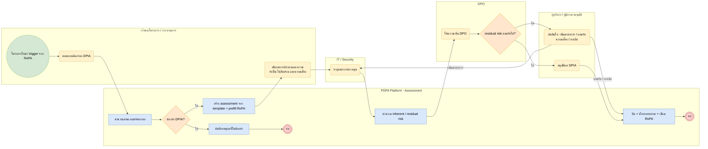

# BP-08 ประเมินผลกระทบด้านการคุ้มครองข้อมูล (DPIA)

> Trigger: โครงการใหม่ / เปลี่ยนแปลงสำคัญ / RoPA เข้าเกณฑ์เสี่ยงสูง  
> ผลลัพธ์: DPIA ที่มีความเห็น DPO และการตัดสินใจของผู้มีอำนาจ  
> UC: DPIA-01 ถึง DPIA-18  
> ต้นฉบับ: `design/PDPA_System_Analysis.drawio` → หน้า **BP-08 ประเมินผลกระทบด้านการคุ้มครองข้อมูล**

## Use case ที่ครอบคลุม

- [DPIA-01](../modules/DPIA.md#dpia-01) แบบคัดกรองความจำเป็นในการทำ DPIA
- [DPIA-02](../modules/DPIA.md#dpia-02) เกณฑ์คะแนนและเงื่อนไขบังคับทำ DPIA
- [DPIA-03](../modules/DPIA.md#dpia-03) คลัง template แบบประเมิน
- [DPIA-04](../modules/DPIA.md#dpia-04) อธิบายกิจกรรมโดยดึงข้อมูลจาก RoPA
- [DPIA-05](../modules/DPIA.md#dpia-05) ประเมินความจำเป็นและความได้สัดส่วน
- [DPIA-06](../modules/DPIA.md#dpia-06) ระบุและให้คะแนนความเสี่ยง
- [DPIA-07](../modules/DPIA.md#dpia-07) มาตรการลดความเสี่ยงและความเสี่ยงคงเหลือ
- [DPIA-08](../modules/DPIA.md#dpia-08) เชื่อมทะเบียนความเสี่ยงและงานแก้ไข
- [DPIA-09](../modules/DPIA.md#dpia-09) เชิญผู้ร่วมประเมิน
- [DPIA-10](../modules/DPIA.md#dpia-10) ความเห็น DPO และการอนุมัติ
- [DPIA-11](../modules/DPIA.md#dpia-11) บันทึกการปรึกษาผู้มีส่วนได้เสีย
- [DPIA-12](../modules/DPIA.md#dpia-12) ทะเบียนและสถานะ DPIA
- [DPIA-13](../modules/DPIA.md#dpia-13) ทบทวนเมื่อกิจกรรมเปลี่ยนหรือครบรอบ
- [DPIA-14](../modules/DPIA.md#dpia-14) ประวัติเวอร์ชันและ audit trail
- [DPIA-15](../modules/DPIA.md#dpia-15) ออกรายงาน DPIA
- [DPIA-16](../modules/DPIA.md#dpia-16) ประเมินฐานประโยชน์โดยชอบด้วยกฎหมาย (LIA)
- [DPIA-17](../modules/DPIA.md#dpia-17) ประเมินผลกระทบของระบบ AI
- [DPIA-18](../modules/DPIA.md#dpia-18) AI ช่วยกรอกแบบประเมินจากเอกสาร

## Diagram

สัญลักษณ์: วงกลม = เริ่ม · วงกลมซ้อน = จบ · สี่เหลี่ยมมุมมน (เหลือง) = งานของคน · สี่เหลี่ยม (ฟ้า) = งานของระบบ · ข้าวหลามตัด = gateway · หกเหลี่ยม ⏱ = timer / เหตุการณ์ตามเวลา

## ขั้นตอน

| # | node | lane | ประเภท | ขั้นตอน | API / ตาราง |
|---|---|---|---|---|---|
| 1 | s | เจ้าของโครงการ / กระบวนการ | เริ่ม | โครงการใหม่ / trigger จาก RoPA |  |
| 2 | t1 | เจ้าของโครงการ / กระบวนการ | งานของคน | ตอบแบบคัดกรอง DPIA |  |
| 3 | t2 | PDPA Platform · Assessment | งานของระบบ | คำนวณตามเกณฑ์คัดกรอง | screening_rules |
| 4 | g1 | PDPA Platform · Assessment | gateway | ต้องทำ DPIA? |  |
| 5 | t3 | PDPA Platform · Assessment | งานของระบบ | บันทึกเหตุผลที่ไม่ต้องทำ |  |
| 6 | e1 | PDPA Platform · Assessment | จบ | จบ |  |
| 7 | t4 | PDPA Platform · Assessment | งานของระบบ | สร้าง assessment จาก template + prefill RoPA | assessments · sections |
| 8 | t5 | เจ้าของโครงการ / กระบวนการ | งานของคน | อธิบายการประมวลผล ความจำเป็น ได้สัดส่วน และความเสี่ยง | answers |
| 9 | t6 | IT / Security | งานของคน | ระบุมาตรการควบคุม |  |
| 10 | t7 | PDPA Platform · Assessment | งานของระบบ | คำนวณ inherent / residual risk | risk.risks · risk_controls |
| 11 | t8 | DPO | งานของคน | ให้ความเห็น DPO | dpo_opinions |
| 12 | g2 | DPO | gateway | residual risk ยอมรับได้? |  |
| 13 | t10 | ผู้บริหาร / ผู้มีอำนาจอนุมัติ | งานของคน | อนุมัติผล DPIA |  |
| 14 | t9 | ผู้บริหาร / ผู้มีอำนาจอนุมัติ | งานของคน | ตัดสินใจ: เพิ่มมาตรการ / ยอมรับความเสี่ยง / ยกเลิก | risk.acceptances |
| 15 | t11 | PDPA Platform · Assessment | งานของระบบ | ปิด + ตั้งรอบทบทวน + เชื่อม RoPA |  |
| 16 | e | PDPA Platform · Assessment | จบ | จบ |  |

### เงื่อนไขบนเส้นทาง

| จาก | เงื่อนไข / ข้อความ | ไป |
|---|---|---|
| g1 · ต้องทำ DPIA? | ไม่ | t3 · บันทึกเหตุผลที่ไม่ต้องทำ |
| g1 · ต้องทำ DPIA? | ใช่ | t4 · สร้าง assessment จาก template + prefill RoPA |
| g2 · residual risk ยอมรับได้? | ใช่ | t10 · อนุมัติผล DPIA |
| g2 · residual risk ยอมรับได้? | ไม่ | t9 · ตัดสินใจ: เพิ่มมาตรการ / ยอมรับความเสี่ยง / ยกเลิก |
| t9 · ตัดสินใจ: เพิ่มมาตรการ / ยอมรับความเสี่ยง / ยกเลิก | เพิ่มมาตรการ | t6 · ระบุมาตรการควบคุม |
| t9 · ตัดสินใจ: เพิ่มมาตรการ / ยอมรับความเสี่ยง / ยกเลิก | ยอมรับ / ยกเลิก | t11 · ปิด + ตั้งรอบทบทวน + เชื่อม RoPA |

## กฎทางธุรกิจและข้อกำหนดกฎหมาย (ต้องมี test ครอบคลุม)

1. ทำ DPIA เมื่อการประมวลผลมีแนวโน้มความเสี่ยงสูง: ข้อมูลอ่อนไหว (ม.26), การติดตามพฤติกรรมอย่างเป็นระบบ, ปริมาณมาก, เทคโนโลยีใหม่ / AI, กลุ่มเปราะบาง (เกณฑ์ตาม TDPG)
2. ผลคัดกรองว่าไม่ต้องทำต้องบันทึกเหตุผล (หลักฐานการตัดสินใจ)
3. ความเห็น DPO ต้องบันทึกไว้แม้ผู้บริหารตัดสินใจต่างออกไป (ความเป็นอิสระของ DPO ม.42)
4. การยอมรับความเสี่ยงต้องมีผู้มีอำนาจตามเกณฑ์ risk matrix และวันหมดอายุการยอมรับ
5. มาตรการต้องเหมาะสมตาม ม.37(1) และประกาศมาตรการความปลอดภัย พ.ศ. 2565; ทบทวน DPIA เมื่อกิจกรรมเปลี่ยน หรือทุก 12 เดือน

## ข้อมูลที่เกี่ยวข้อง

- [assess.templates](../data/assess.md#assess-templates) · [assess.screening_rules](../data/assess.md#assess-screening-rules) · [assess.assessments](../data/assess.md#assess-assessments)
- [assess.sections](../data/assess.md#assess-sections) · [assess.answers](../data/assess.md#assess-answers) · [assess.assessment_risks](../data/assess.md#assess-assessment-risks) · [assess.dpo_opinions](../data/assess.md#assess-dpo-opinions)
- [risk.risks](../data/risk.md#risk-risks) · [risk.risk_controls](../data/risk.md#risk-risk-controls) · [risk.controls](../data/risk.md#risk-controls) · [risk.acceptances](../data/risk.md#risk-acceptances)
- [ropa.processing_activities](../data/ropa.md#ropa-processing-activities) (source)

## API / event / job

- POST /admin/v1/assessments (type = DPIA)
- POST /admin/v1/assessments/{id}/submit · /opinion · /decision
- event: risk.dpia_required · dpia.submitted · dpia.approved · risk.accepted
