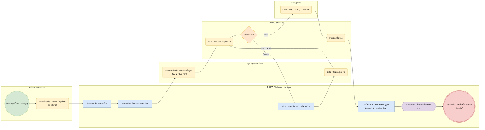

# BP-09 รับคู่ค้าใหม่และติดตามความเสี่ยงคู่ค้า (Vendor onboarding & monitoring)

> Trigger: ต้องการใช้บริการคู่ค้าที่เข้าถึงข้อมูลส่วนบุคคล / ครบรอบประเมิน  
> ผลลัพธ์: คู่ค้าผ่านการประเมิน มี DPA และถูกเชื่อมกับ RoPA  
> UC: VEN-01 ถึง VEN-15  
> ต้นฉบับ: `design/PDPA_System_Analysis.drawio` → หน้า **BP-09 รับคู่ค้าใหม่และติดตามความเสี่ยงคู่ค้า**

## Use case ที่ครอบคลุม

- [VEN-01](../modules/VEN.md#ven-01) ทะเบียนคู่ค้าและผู้ประมวลผล
- [VEN-02](../modules/VEN.md#ven-02) จัดระดับความเสี่ยงคู่ค้า
- [VEN-03](../modules/VEN.md#ven-03) ผู้ประมวลผลช่วง
- [VEN-04](../modules/VEN.md#ven-04) คลังแบบประเมินคู่ค้า
- [VEN-05](../modules/VEN.md#ven-05) พอร์ทัลให้คู่ค้าตอบแบบประเมิน
- [VEN-06](../modules/VEN.md#ven-06) ตรวจหลักฐานและใบรับรอง
- [VEN-07](../modules/VEN.md#ven-07) คำนวณคะแนนความเสี่ยงอัตโนมัติ
- [VEN-08](../modules/VEN.md#ven-08) อนุมัติหรือปฏิเสธคู่ค้า
- [VEN-09](../modules/VEN.md#ven-09) แผนแก้ไขข้อบกพร่องของคู่ค้า
- [VEN-10](../modules/VEN.md#ven-10) ประเมินซ้ำตามรอบ
- [VEN-11](../modules/VEN.md#ven-11) ผูกคู่ค้ากับสัญญาและกิจกรรม
- [VEN-12](../modules/VEN.md#ven-12) เหตุละเมิดที่เกี่ยวกับคู่ค้า
- [VEN-13](../modules/VEN.md#ven-13) แดชบอร์ดความเสี่ยงคู่ค้า
- [VEN-14](../modules/VEN.md#ven-14) ยุติการใช้บริการ
- [VEN-15](../modules/VEN.md#ven-15) AI ช่วยประเมินคู่ค้า

## Diagram

สัญลักษณ์: วงกลม = เริ่ม · วงกลมซ้อน = จบ · สี่เหลี่ยมมุมมน (เหลือง) = งานของคน · สี่เหลี่ยม (ฟ้า) = งานของระบบ · ข้าวหลามตัด = gateway · หกเหลี่ยม ⏱ = timer / เหตุการณ์ตามเวลา

## ขั้นตอน

| # | node | lane | ประเภท | ขั้นตอน | API / ตาราง |
|---|---|---|---|---|---|
| 1 | s | จัดซื้อ / เจ้าของงาน | เริ่ม | ต้องการคู่ค้าใหม่ / ต่อสัญญา |  |
| 2 | t1 | จัดซื้อ / เจ้าของงาน | งานของคน | กรอก intake: บริการ ข้อมูลที่เข้าถึง ประเทศ | vendor.intakes |
| 3 | t2 | PDPA Platform · Vendor | งานของระบบ | คัดกรอง tier ความเสี่ยง |  |
| 4 | t3 | PDPA Platform · Vendor | งานของระบบ | ส่งแบบประเมินผ่าน guest link | iam.guest_tokens |
| 5 | t4 | คู่ค้า (guest link) | งานของคน | ตอบแบบประเมิน + แนบหลักฐาน (ISO 27001 ฯลฯ) | vendor_assessments · certificates |
| 6 | t5 | DPO / Security | งานของคน | ตรวจ ให้คะแนน ระบุช่องว่าง |  |
| 7 | g1 | DPO / Security | gateway | ผ่านเกณฑ์? |  |
| 8 | t6 | PDPA Platform · Vendor | งานของระบบ | สร้าง remediation + กำหนดวัน | remediation_items |
| 9 | t7 | คู่ค้า (guest link) | งานของคน | แก้ไข / ส่งหลักฐานเพิ่ม |  |
| 10 | t8 | ฝ่ายกฎหมาย | งานของคน | จัดทำ DPA / DSA (→ BP-10) |  |
| 11 | t9 | DPO / Security | งานของคน | อนุมัติการใช้คู่ค้า |  |
| 12 | t10 | PDPA Platform · Vendor | งานของระบบ | เปิดใช้งาน + เชื่อม RoPA (ผู้รับข้อมูล) + ตั้งรอบประเมินซ้ำ |  |
| 13 | m1 | PDPA Platform · Vendor | timer / เหตุการณ์ | ครบรอบ / ใบรับรองใกล้หมดอายุ |  |
| 14 | x1 | PDPA Platform · Vendor | จบ (ส่งข้อความ) | ประเมินซ้ำ: กลับไปขั้น “ส่งแบบประเมิน” |  |

### เงื่อนไขบนเส้นทาง

| จาก | เงื่อนไข / ข้อความ | ไป |
|---|---|---|
| g1 · ผ่านเกณฑ์? | ไม่ผ่าน | t6 · สร้าง remediation + กำหนดวัน |
| t7 · แก้ไข / ส่งหลักฐานเพิ่ม | ส่งตรวจใหม่ | t5 · ตรวจ ให้คะแนน ระบุช่องว่าง |
| g1 · ผ่านเกณฑ์? | ผ่าน | t8 · จัดทำ DPA / DSA (→ BP-10) |

## กฎทางธุรกิจและข้อกำหนดกฎหมาย (ต้องมี test ครอบคลุม)

1. ผู้ควบคุมข้อมูลต้องจัดให้มีข้อตกลงควบคุมการดำเนินงานของผู้ประมวลผลให้เป็นไปตามกฎหมาย (ม.40)
2. ส่งหรือโอนข้อมูลไปต่างประเทศต้องเป็นไปตาม ม.28 / ม.29 และประกาศ สคส. พ.ศ. 2566 → บันทึกใน activity_transfers
3. รอบประเมินซ้ำตาม tier (ค่าเริ่มต้น: สูง 12 เดือน · กลาง 24 เดือน · ต่ำ 36 เดือน) และเมื่อใบรับรองหมดอายุ
4. คู่ค้าเข้าระบบด้วย guest link ที่หมดอายุและเห็นเฉพาะแบบประเมินของตน
5. สิ้นสุดสัญญา: offboarding ขอคืน / ทำลายข้อมูลพร้อมหลักฐาน

## ข้อมูลที่เกี่ยวข้อง

- [vendor.vendors](../data/vendor.md#vendor-vendors) · [vendor.intakes](../data/vendor.md#vendor-intakes) · [vendor.vendor_assessments](../data/vendor.md#vendor-vendor-assessments)
- [vendor.remediation_items](../data/vendor.md#vendor-remediation-items) · [vendor.certificates](../data/vendor.md#vendor-certificates) · [vendor.sub_processors](../data/vendor.md#vendor-sub-processors) · [vendor.offboardings](../data/vendor.md#vendor-offboardings)
- [iam.guest_tokens](../data/iam.md#iam-guest-tokens) · [assess.assessments](../data/assess.md#assess-assessments)
- [agreement.agreements](../data/agreement.md#agreement-agreements) (DPA)

## API / event / job

- POST /admin/v1/vendors/intakes
- GET /public/v1/guest/{token}/assessment · POST …/answers
- event: vendor.assessment_completed · vendor.approved · vendor.certificate_expiring
