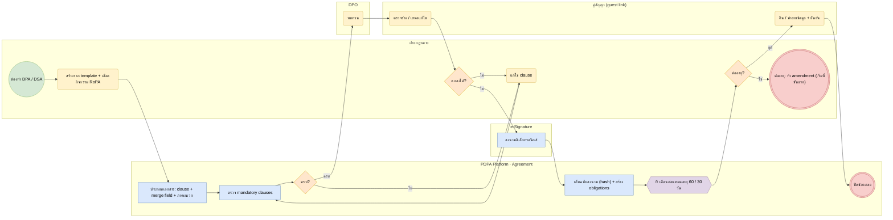

# BP-10 จัดทำและบริหารข้อตกลง DPA / DSA (Agreement lifecycle)

> Trigger: ใช้ผู้ประมวลผล / แบ่งปันข้อมูลกับผู้ควบคุมรายอื่น / ต่ออายุ  
> ผลลัพธ์: ข้อตกลงลงนาม มีภาระหน้าที่ที่ติดตามได้ และปิดสัญญาอย่างถูกต้อง  
> UC: DPA-01 ถึง DPA-14, DSA-01 ถึง DSA-14  
> ต้นฉบับ: `design/PDPA_System_Analysis.drawio` → หน้า **BP-10 จัดทำและบริหารข้อตกลง DPA / DSA**

## Use case ที่ครอบคลุม

- [DPA-01](../modules/DPA.md#dpa-01) Template DPA มาตรฐาน
- [DPA-02](../modules/DPA.md#dpa-02) สร้างแบบกรอกเองและแบบอัตโนมัติ
- [DPA-03](../modules/DPA.md#dpa-03) ข้อกำหนดที่ต้องมี
- [DPA-04](../modules/DPA.md#dpa-04) ภาคผนวกรายละเอียดการประมวลผล
- [DPA-05](../modules/DPA.md#dpa-05) ข้อสัญญาการโอนต่างประเทศ
- [DPA-06](../modules/DPA.md#dpa-06) แก้ไขเอกสารในระบบ
- [DPA-07](../modules/DPA.md#dpa-07) ตรวจทานและอนุมัติ
- [DPA-08](../modules/DPA.md#dpa-08) เวอร์ชันและประวัติการดาวน์โหลด
- [DPA-09](../modules/DPA.md#dpa-09) ส่งออกและลงนามอิเล็กทรอนิกส์
- [DPA-10](../modules/DPA.md#dpa-10) ทะเบียน DPA และแจ้งเตือนหมดอายุ
- [DPA-11](../modules/DPA.md#dpa-11) ผูก DPA กับคู่ค้าและกิจกรรม
- [DPA-12](../modules/DPA.md#dpa-12) แจ้งเตือนผู้ประมวลผลที่ยังไม่มี DPA
- [DPA-13](../modules/DPA.md#dpa-13) ติดตามการคืน/ทำลายข้อมูลเมื่อสิ้นสุด
- [DPA-14](../modules/DPA.md#dpa-14) ตรวจ DPA ที่ได้รับจากลูกค้า
- [DSA-01](../modules/DSA.md#dsa-01) ตรวจว่าต้องใช้ DSA หรือ DPA
- [DSA-02](../modules/DSA.md#dsa-02) ข้อมูลคู่สัญญาและบทบาท
- [DSA-03](../modules/DSA.md#dsa-03) Template DSA มาตรฐาน
- [DSA-04](../modules/DSA.md#dsa-04) สร้างเอกสารอัตโนมัติจาก RoPA
- [DSA-05](../modules/DSA.md#dsa-05) ข้อกำหนดที่ต้องมี
- [DSA-06](../modules/DSA.md#dsa-06) คลังข้อความสัญญา
- [DSA-07](../modules/DSA.md#dsa-07) ภาคผนวกประกอบข้อตกลง
- [DSA-08](../modules/DSA.md#dsa-08) ตรวจทานและอนุมัติ
- [DSA-09](../modules/DSA.md#dsa-09) เวอร์ชันและประวัติ
- [DSA-10](../modules/DSA.md#dsa-10) ส่งออกและลงนามอิเล็กทรอนิกส์
- [DSA-11](../modules/DSA.md#dsa-11) ทะเบียนข้อตกลงและแจ้งเตือนหมดอายุ
- [DSA-12](../modules/DSA.md#dsa-12) ผูกข้อตกลงกับกิจกรรมและแผนผัง
- [DSA-13](../modules/DSA.md#dsa-13) ติดตามภาระผูกพันตามข้อตกลง
- [DSA-14](../modules/DSA.md#dsa-14) รองรับการแบ่งปันข้อมูลระหว่างหน่วยงานรัฐ

## Diagram

สัญลักษณ์: วงกลม = เริ่ม · วงกลมซ้อน = จบ · สี่เหลี่ยมมุมมน (เหลือง) = งานของคน · สี่เหลี่ยม (ฟ้า) = งานของระบบ · ข้าวหลามตัด = gateway · หกเหลี่ยม ⏱ = timer / เหตุการณ์ตามเวลา

## ขั้นตอน

| # | node | lane | ประเภท | ขั้นตอน | API / ตาราง |
|---|---|---|---|---|---|
| 1 | s | ฝ่ายกฎหมาย | เริ่ม | ต้องทำ DPA / DSA |  |
| 2 | t1 | ฝ่ายกฎหมาย | งานของคน | สร้างจาก template + เลือกกิจกรรม RoPA |  |
| 3 | t2 | PDPA Platform · Agreement | งานของระบบ | ประกอบเอกสาร: clause + merge field + ภาคผนวก | agreements · clauses · annexes |
| 4 | t3 | PDPA Platform · Agreement | งานของระบบ | ตรวจ mandatory clauses | mandatory_rules |
| 5 | g1 | PDPA Platform · Agreement | gateway | ครบ? |  |
| 6 | t4 | ฝ่ายกฎหมาย | งานของคน | แก้ไข clause |  |
| 7 | t5 | DPO | งานของคน | ทบทวน |  |
| 8 | t6 | คู่สัญญา (guest link) | งานของคน | ตรวจร่าง / เสนอแก้ไข |  |
| 9 | g2 | ฝ่ายกฎหมาย | gateway | ตกลงได้? |  |
| 10 | t7 | e-Signature | งานของระบบ | ลงนามอิเล็กทรอนิกส์ | signature_requests |
| 11 | t8 | PDPA Platform · Agreement | งานของระบบ | เก็บฉบับลงนาม (hash) + สร้าง obligations | document_versions · obligations |
| 12 | m1 | PDPA Platform · Agreement | timer / เหตุการณ์ | เตือนก่อนหมดอายุ 60 / 30 วัน |  |
| 13 | g3 | ฝ่ายกฎหมาย | gateway | ต่ออายุ? |  |
| 14 | x1 | ฝ่ายกฎหมาย | จบ (ส่งข้อความ) | ต่ออายุ: ทำ amendment (เริ่มที่ขั้นแรก) |  |
| 15 | t9 | คู่สัญญา (guest link) | งานของคน | คืน / ทำลายข้อมูล + ยืนยัน | return_confirmations |
| 16 | e | PDPA Platform · Agreement | จบ | ปิดข้อตกลง |  |

### เงื่อนไขบนเส้นทาง

| จาก | เงื่อนไข / ข้อความ | ไป |
|---|---|---|
| g1 · ครบ? | ไม่ | t4 · แก้ไข clause |
| g1 · ครบ? | ครบ | t5 · ทบทวน |
| g2 · ตกลงได้? | ไม่ | t4 · แก้ไข clause |
| g2 · ตกลงได้? | ใช่ | t7 · ลงนามอิเล็กทรอนิกส์ |
| g3 · ต่ออายุ? | ใช่ | x1 · ต่ออายุ: ทำ amendment (เริ่มที่ขั้นแรก) |
| g3 · ต่ออายุ? | ยุติ | t9 · คืน / ทำลายข้อมูล + ยืนยัน |

## กฎทางธุรกิจและข้อกำหนดกฎหมาย (ต้องมี test ครอบคลุม)

1. DPA ต้องกำหนดให้ผู้ประมวลผลทำตามคำสั่งของผู้ควบคุม มีมาตรการความปลอดภัย แจ้งเหตุละเมิด และจัดทำบันทึกรายการ (ม.40)
2. DSA / การเปิดเผยแก่ผู้ควบคุมรายอื่น: ระบุวัตถุประสงค์ ฐานกฎหมาย ข้อจำกัดการใช้ และบันทึกการเปิดเผย (ม.27, ม.39)
3. การโอนข้ามประเทศต้องมีฐานตาม ม.28 หรือมาตรการคุ้มครองที่เหมาะสมตาม ม.29 (BCR / ข้อสัญญามาตรฐาน)
4. ฉบับลงนามแก้ไขไม่ได้; การเปลี่ยนแปลงทำเป็น amendment (เวอร์ชันใหม่ อ้างอิงฉบับเดิม)
5. obligations มีผู้รับผิดชอบและวันครบกำหนด แจ้งเตือนผ่าน workflow

## ข้อมูลที่เกี่ยวข้อง

- [agreement.agreements](../data/agreement.md#agreement-agreements) · [agreement.parties](../data/agreement.md#agreement-parties) · [agreement.agreement_activities](../data/agreement.md#agreement-agreement-activities)
- [agreement.clauses](../data/agreement.md#agreement-clauses) · [agreement.mandatory_rules](../data/agreement.md#agreement-mandatory-rules) · [agreement.annexes](../data/agreement.md#agreement-annexes)
- [agreement.signature_requests](../data/agreement.md#agreement-signature-requests) · [agreement.obligations](../data/agreement.md#agreement-obligations) · [agreement.return_confirmations](../data/agreement.md#agreement-return-confirmations) · [agreement.downloads](../data/agreement.md#agreement-downloads)
- [platform.templates](../data/platform.md#platform-templates) · [platform.clause_library](../data/platform.md#platform-clause-library) · [platform.documents](../data/platform.md#platform-documents) · [platform.document_versions](../data/platform.md#platform-document-versions)

## API / event / job

- POST /admin/v1/agreements · POST …/{id}/render (Gotenberg)
- POST …/{id}/signature-requests → callback /webhooks/esign
- event: agreement.signed · agreement.expiring · agreement.terminated
