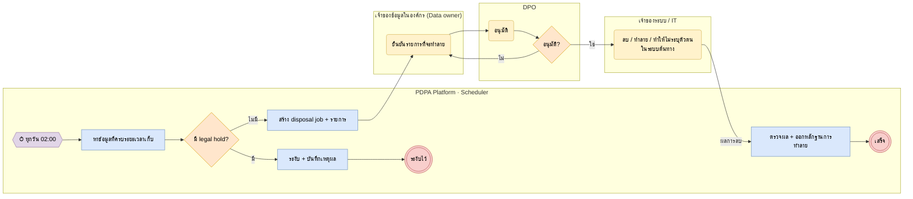

# BP-11 ระยะเวลาเก็บรักษาและการทำลายข้อมูล (Retention & disposal)

> Trigger: งานตรวจรายวันพบข้อมูลครบกำหนด  
> ผลลัพธ์: ข้อมูลถูกลบ / ทำลาย / ทำให้ไม่ระบุตัวตน พร้อมหลักฐาน หรือระงับด้วย legal hold  
> UC: DPX-05, DPX-06, ROPA-10  
> ต้นฉบับ: `design/PDPA_System_Analysis.drawio` → หน้า **BP-11 ระยะเวลาเก็บรักษาและการทำลายข้อมูล**

## Use case ที่ครอบคลุม

- [DPX-05](../modules/DPX.md#dpx-05) บริหารการเก็บรักษาและทำลายข้อมูล
- [DPX-06](../modules/DPX.md#dpx-06) ประเมินการโอนข้อมูลไปต่างประเทศ (TIA)
- [ROPA-10](../modules/ROPA.md#ropa-10) บันทึกการปฏิเสธคำขอใช้สิทธิ

## Diagram

สัญลักษณ์: วงกลม = เริ่ม · วงกลมซ้อน = จบ · สี่เหลี่ยมมุมมน (เหลือง) = งานของคน · สี่เหลี่ยม (ฟ้า) = งานของระบบ · ข้าวหลามตัด = gateway · หกเหลี่ยม ⏱ = timer / เหตุการณ์ตามเวลา

## ขั้นตอน

| # | node | lane | ประเภท | ขั้นตอน | API / ตาราง |
|---|---|---|---|---|---|
| 1 | m1 | PDPA Platform · Scheduler | timer / เหตุการณ์ | ทุกวัน 02:00 |  |
| 2 | t1 | PDPA Platform · Scheduler | งานของระบบ | หาข้อมูลที่ครบระยะเวลาเก็บ | retention_schedules · retention_rules |
| 3 | g1 | PDPA Platform · Scheduler | gateway | มี legal hold? |  |
| 4 | t2 | PDPA Platform · Scheduler | งานของระบบ | ระงับ + บันทึกเหตุผล | dsar.legal_holds |
| 5 | e1 | PDPA Platform · Scheduler | จบ | ระงับไว้ |  |
| 6 | t3 | PDPA Platform · Scheduler | งานของระบบ | สร้าง disposal job + รายการ | disposal_jobs |
| 7 | t4 | เจ้าของข้อมูลในองค์กร (Data owner) | งานของคน | ยืนยันรายการที่จะทำลาย |  |
| 8 | t5 | DPO | งานของคน | อนุมัติ |  |
| 9 | g2 | DPO | gateway | อนุมัติ? |  |
| 10 | t6 | เจ้าของระบบ / IT | งานของคน | ลบ / ทำลาย / ทำให้ไม่ระบุตัวตนในระบบต้นทาง |  |
| 11 | t7 | PDPA Platform · Scheduler | งานของระบบ | ตรวจผล + ออกหลักฐานการทำลาย |  |
| 12 | e2 | PDPA Platform · Scheduler | จบ | เสร็จ |  |

### เงื่อนไขบนเส้นทาง

| จาก | เงื่อนไข / ข้อความ | ไป |
|---|---|---|
| g1 · มี legal hold? | มี | t2 · ระงับ + บันทึกเหตุผล |
| g1 · มี legal hold? | ไม่มี | t3 · สร้าง disposal job + รายการ |
| g2 · อนุมัติ? | ไม่ | t4 · ยืนยันรายการที่จะทำลาย |
| g2 · อนุมัติ? | ใช่ | t6 · ลบ / ทำลาย / ทำให้ไม่ระบุตัวตนในระบบต้นทาง |
| t6 · ลบ / ทำลาย / ทำให้ไม่ระบุตัวตนในระบบต้นทาง | ผลการลบ | t7 · ตรวจผล + ออกหลักฐานการทำลาย |

## กฎทางธุรกิจและข้อกำหนดกฎหมาย (ต้องมี test ครอบคลุม)

1. ต้องลบ ทำลาย หรือทำให้ไม่สามารถระบุตัวบุคคลได้ เมื่อพ้นระยะเวลาเก็บ หรือไม่เกี่ยวข้อง / เกินความจำเป็น หรือเมื่อถอนความยินยอม (ม.37(3))
2. legal hold (คดี ข้อพิพาท คำสั่งหน่วยงาน) ระงับการลบจนกว่าจะปลด และต้องระบุเหตุผล
3. หลักฐานการทำลายเก็บเป็น audit record ที่ไม่มีข้อมูลส่วนบุคคล
4. ข้อมูลใน backup หมดอายุตามรอบ backup ที่ระบุในนโยบาย (ไม่กู้คืนข้อมูลที่ทำลายแล้ว)

## ข้อมูลที่เกี่ยวข้อง

- [gov.retention_schedules](../data/gov.md#gov-retention-schedules) · [gov.disposal_jobs](../data/gov.md#gov-disposal-jobs)
- [ropa.retention_rules](../data/ropa.md#ropa-retention-rules)
- [dsar.legal_holds](../data/dsar.md#dsar-legal-holds)
- [platform.audit_log](../data/platform.md#platform-audit-log) ⟨P⟩

## API / event / job

- job: retention.sweep (River cron 02:00)
- event: retention.due · disposal.approved · disposal.completed
- connector: คำสั่งลบไปยังระบบต้นทาง (webhook / ITSM ticket)
