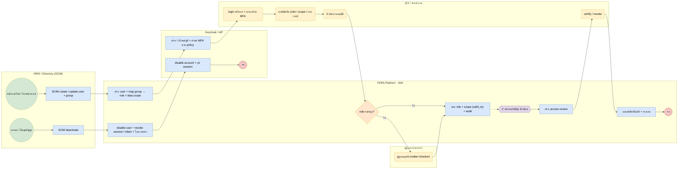

# BP-12 บริหารผู้ใช้และสิทธิ์ (Joiner-Mover-Leaver & access review)

> Trigger: HR/Directory เปลี่ยนแปลงพนักงาน / ผู้ใช้ขอสิทธิ์ / รอบทบทวนสิทธิ์  
> ผลลัพธ์: สิทธิ์ถูกต้องตามหน้าที่ มีหลักฐานการอนุมัติและทบทวน  
> UC: ORG-09 ถึง ORG-19, IAM-01 ถึง IAM-10  
> ต้นฉบับ: `design/PDPA_System_Analysis.drawio` → หน้า **BP-12 บริหารผู้ใช้และสิทธิ์**

## Use case ที่ครอบคลุม

- [ORG-09](../modules/IAM.md#org-09) จัดการผู้ใช้
- [ORG-10](../modules/IAM.md#org-10) Role และ Permission
- [ORG-11](../modules/IAM.md#org-11) ขอบเขตข้อมูลตามหน่วยงาน
- [ORG-12](../modules/IAM.md#org-12) กลุ่มผู้ใช้และทีม
- [ORG-13](../modules/IAM.md#org-13) โปรไฟล์และการตั้งค่าส่วนตัว
- [ORG-14](../modules/IAM.md#org-14) Login นโยบายรหัสผ่าน และ MFA
- [ORG-15](../modules/IAM.md#org-15) Single Sign-On และ ThaID
- [ORG-16](../modules/IAM.md#org-16) API Client และ Service account
- [ORG-17](../modules/IAM.md#org-17) ปกปิดข้อมูลส่วนบุคคลบนหน้าจอ
- [ORG-18](../modules/IAM.md#org-18) ทบทวนสิทธิ์ตามรอบ
- [ORG-19](../modules/IAM.md#org-19) Audit log
- [IAM-01](../modules/IAM.md#iam-01) Identity provider และ login flow
- [IAM-02](../modules/IAM.md#iam-02) Permission engine (RBAC + data scope)
- [IAM-03](../modules/IAM.md#iam-03) Console ผู้ให้บริการ: tenant และแพ็กเกจ
- [IAM-04](../modules/IAM.md#iam-04) สิทธิ์ผู้ใช้ภายนอก (guest)
- [IAM-05](../modules/IAM.md#iam-05) บริการยืนยันตัวตนเจ้าของข้อมูล
- [IAM-06](../modules/IAM.md#iam-06) Maker-checker สำหรับงานผู้ดูแลระบบ
- [IAM-07](../modules/IAM.md#iam-07) Break-glass และสิทธิ์ระดับสูง
- [IAM-08](../modules/IAM.md#iam-08) จัดการ session และแจ้งเตือนความปลอดภัย
- [IAM-09](../modules/IAM.md#iam-09) SCIM 2.0 provisioning
- [IAM-10](../modules/IAM.md#iam-10) สิทธิ์ชั่วคราวและมอบอำนาจ

## Diagram

สัญลักษณ์: วงกลม = เริ่ม · วงกลมซ้อน = จบ · สี่เหลี่ยมมุมมน (เหลือง) = งานของคน · สี่เหลี่ยม (ฟ้า) = งานของระบบ · ข้าวหลามตัด = gateway · หกเหลี่ยม ⏱ = timer / เหตุการณ์ตามเวลา

## ขั้นตอน

| # | node | lane | ประเภท | ขั้นตอน | API / ตาราง |
|---|---|---|---|---|---|
| 1 | s1 | HRIS / Directory (SCIM) | เริ่ม | พนักงานใหม่ / ย้ายหน่วยงาน |  |
| 2 | t1 | HRIS / Directory (SCIM) | งานของระบบ | SCIM create / update user + group | POST /scim/v2/Users |
| 3 | t2 | PDPA Platform · IAM | งานของระบบ | สร้าง user + map group → role + data scope | users · role_assignments |
| 4 | t3 | Keycloak / IdP | งานของระบบ | สร้าง / เชื่อมบัญชี + บังคับ MFA ตาม policy |  |
| 5 | t4 | ผู้ใช้ / หัวหน้างาน | งานของคน | login ครั้งแรก + ลงทะเบียน MFA |  |
| 6 | t5 | ผู้ใช้ / หัวหน้างาน | งานของคน | ขอสิทธิ์เพิ่ม (role / scope / ระยะเวลา) |  |
| 7 | t6 | ผู้ใช้ / หัวหน้างาน | งานของคน | หัวหน้างานอนุมัติ |  |
| 8 | g1 | PDPA Platform · IAM | gateway | role ระดับสูง? |  |
| 9 | t7 | ผู้ดูแลระบบองค์กร | งานของคน | ผู้ดูแลอนุมัติ (maker-checker) | platform.approvals |
| 10 | t8 | PDPA Platform · IAM | งานของระบบ | มอบ role + scope (valid_to) + audit | role_assignments |
| 11 | m1 | PDPA Platform · IAM | timer / เหตุการณ์ | ทบทวนสิทธิ์ทุก 6 เดือน |  |
| 12 | t9 | PDPA Platform · IAM | งานของระบบ | สร้าง access review | access_reviews · items |
| 13 | t10 | ผู้ใช้ / หัวหน้างาน | งานของคน | certify / revoke |  |
| 14 | t11 | PDPA Platform · IAM | งานของระบบ | ถอนสิทธิ์อัตโนมัติ + รายงาน |  |
| 15 | e1 | PDPA Platform · IAM | จบ | จบ |  |
| 16 | s2 | HRIS / Directory (SCIM) | เริ่ม | ลาออก / สิ้นสุดสัญญา |  |
| 17 | t12 | HRIS / Directory (SCIM) | งานของระบบ | SCIM deactivate |  |
| 18 | t13 | PDPA Platform · IAM | งานของระบบ | disable user + revoke session / token + โอนงานค้าง |  |
| 19 | t14 | Keycloak / IdP | งานของระบบ | disable account + ยุติ session |  |
| 20 | e2 | Keycloak / IdP | จบ | จบ |  |

### เงื่อนไขบนเส้นทาง

| จาก | เงื่อนไข / ข้อความ | ไป |
|---|---|---|
| g1 · role ระดับสูง? | ใช่ | t7 · ผู้ดูแลอนุมัติ (maker-checker) |
| g1 · role ระดับสูง? | ไม่ | t8 · มอบ role + scope (valid_to) + audit |

## กฎทางธุรกิจและข้อกำหนดกฎหมาย (ต้องมี test ครอบคลุม)

1. บัญชีผูกกับตัวบุคคล ไม่มี shared account; ให้สิทธิ์เท่าที่จำเป็นต่อหน้าที่ (least privilege / need-to-know) ตามประกาศมาตรการความปลอดภัย พ.ศ. 2565
2. role ระดับสูง (Org admin, DPO admin, unmask) ต้องผ่าน maker-checker และบังคับ MFA
3. สิทธิ์ชั่วคราว / มอบอำนาจต้องมี valid_to และถูกถอนอัตโนมัติเมื่อครบกำหนด
4. ผู้พ้นสภาพต้องถูกปิดบัญชีภายใน 24 ชั่วโมง (อัตโนมัติทันทีเมื่อได้รับ SCIM / HRIS event) และ revoke refresh token + session ทั้งหมด
5. ทบทวนสิทธิ์ตามรอบ (ค่าเริ่มต้นทุก 6 เดือน ตั้งค่าได้); รายการที่ไม่ได้ certify ภายในกำหนดถูก revoke ถ้าตั้ง auto_revoke

## ข้อมูลที่เกี่ยวข้อง

- [iam.users](../data/iam.md#iam-users) · [iam.groups](../data/iam.md#iam-groups) · [iam.group_members](../data/iam.md#iam-group-members)
- [iam.roles](../data/iam.md#iam-roles) · [iam.permissions](../data/iam.md#iam-permissions) · [iam.role_permissions](../data/iam.md#iam-role-permissions) · [iam.role_assignments](../data/iam.md#iam-role-assignments)
- [iam.access_reviews](../data/iam.md#iam-access-reviews) · [iam.access_review_items](../data/iam.md#iam-access-review-items) · [iam.delegations](../data/iam.md#iam-delegations)
- [iam.security_policies](../data/iam.md#iam-security-policies) · [iam.security_events](../data/iam.md#iam-security-events) ⟨P⟩ · [platform.approvals](../data/platform.md#platform-approvals)

## API / event / job

- SCIM 2.0: /scim/v2/Users · /Groups
- POST /admin/v1/iam/access-requests · /role-assignments
- event: user.provisioned · user.deprovisioned · access.granted · access.revoked
