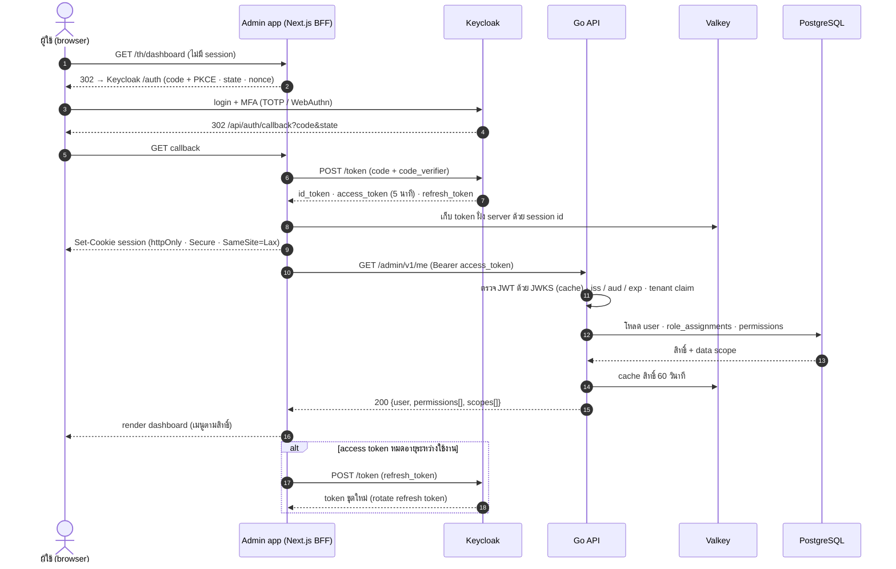

# SEQ-01 Login ผู้ใช้ภายใน (OIDC Authorization Code + PKCE ผ่าน BFF)

> Admin app (Next.js) เป็น confidential client ของ Keycloak · browser ถือเฉพาะ session cookie · Go API ตรวจ JWT ด้วย JWKS  
> ต้นฉบับ: `design/PDPA_System_Analysis.drawio` → หน้า **SEQ-01 Login OIDC + BFF**

## ผู้เกี่ยวข้อง

| key | ชื่อ | ประเภท |
|---|---|---|
| U | ผู้ใช้ (browser) | ผู้ใช้ |
| NX | Admin app (Next.js BFF) | frontend |
| KC | Keycloak | โครงสร้าง / identity |
| API | Go API | backend |
| VK | Valkey | data store |
| PG | PostgreSQL | data store |

## Diagram

## ขั้นตอน (หมายเลขตรงกับ autonumber ใน diagram)

| # | จาก → ถึง | ข้อความ / การทำงาน | frame |
|---|---|---|---|
| 1 | U → NX | GET /th/dashboard (ไม่มี session) |  |
| 2 | NX ⇠ (ตอบกลับ) U | 302 → Keycloak /auth (code + PKCE · state · nonce) |  |
| 3 | U → KC | login + MFA (TOTP / WebAuthn) |  |
| 4 | KC ⇠ (ตอบกลับ) U | 302 /api/auth/callback?code&state |  |
| 5 | U → NX | GET callback |  |
| 6 | NX → KC | POST /token (code + code_verifier) |  |
| 7 | KC ⇠ (ตอบกลับ) NX | id_token · access_token (5 นาที) · refresh_token |  |
| 8 | NX → VK | เก็บ token ฝั่ง server ด้วย session id |  |
| 9 | NX ⇠ (ตอบกลับ) U | Set-Cookie session (httpOnly · Secure · SameSite=Lax) |  |
| 10 | NX → API | GET /admin/v1/me (Bearer access_token) |  |
| 11 | API (ภายใน) | ตรวจ JWT ด้วย JWKS (cache) · iss / aud / exp · tenant claim |  |
| 12 | API → PG | โหลด user · role_assignments · permissions |  |
| 13 | PG ⇠ (ตอบกลับ) API | สิทธิ์ + data scope |  |
| 14 | API → VK | cache สิทธิ์ 60 วินาที |  |
| 15 | API ⇠ (ตอบกลับ) NX | 200 {user, permissions[], scopes[]} |  |
| 16 | NX ⇠ (ตอบกลับ) U | render dashboard (เมนูตามสิทธิ์) |  |
| 17 | NX → KC | POST /token (refresh_token) | alt [access token หมดอายุระหว่างใช้งาน] |
| 18 | KC ⇠ (ตอบกลับ) NX | token ชุดใหม่ (rotate refresh token) | alt [access token หมดอายุระหว่างใช้งาน] |

## ข้อกำหนดสำหรับนักพัฒนา

- browser ไม่เคยเห็น access token · POST ผ่าน BFF ต้องมี CSRF token
- session idle / absolute timeout ตาม iam.security_policies (ค่าเริ่มต้น idle 30 นาที / สูงสุด 12 ชม.)
- first login: ต้องมี user จาก invite / SCIM หรือเปิด JIT (users.source = sso_jit)
- บันทึก security_events: login · login_failed · mfa_enrolled · logout
- logout: ลบ session ใน Valkey + end_session ของ Keycloak (back-channel)

## Module ที่เกี่ยวข้อง

- [IAM — ระบบจัดการผู้ใช้และสิทธิ์ (User & Permission)](../modules/IAM.md)
