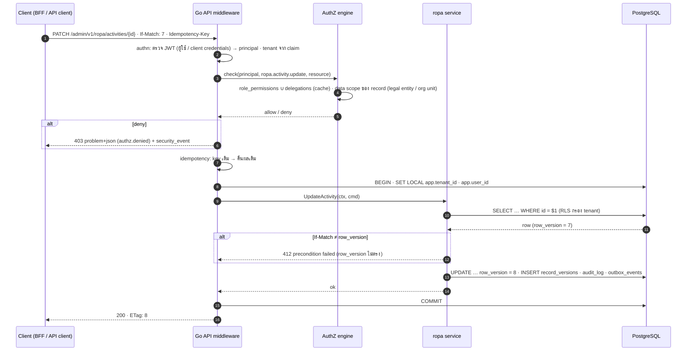

# SEQ-02 การตรวจสิทธิ์ต่อ request (x-permission + data scope + RLS + optimistic lock)

> ตัวอย่าง: แก้ไขกิจกรรม RoPA · ใช้กับทุก endpoint ของ /admin/v1 และ /api/v1  
> ต้นฉบับ: `design/PDPA_System_Analysis.drawio` → หน้า **SEQ-02 API authorization**

## ผู้เกี่ยวข้อง

| key | ชื่อ | ประเภท |
|---|---|---|
| C | Client (BFF / API client) | frontend |
| MW | Go API middleware | backend |
| AZ | AuthZ engine | sec |
| SV | ropa service | backend |
| PG | PostgreSQL | data store |

## Diagram

## ขั้นตอน (หมายเลขตรงกับ autonumber ใน diagram)

| # | จาก → ถึง | ข้อความ / การทำงาน | frame |
|---|---|---|---|
| 1 | C → MW | PATCH /admin/v1/ropa/activities/{id} · If-Match: 7 · Idempotency-Key |  |
| 2 | MW (ภายใน) | authn: ตรวจ JWT (ผู้ใช้ / client credentials) → principal · tenant จาก claim |  |
| 3 | MW → AZ | check(principal, ropa.activity.update, resource) |  |
| 4 | AZ (ภายใน) | role_permissions ∪ delegations (cache) · data scope ของ record (legal entity / org unit) |  |
| 5 | AZ ⇠ (ตอบกลับ) MW | allow / deny |  |
| 6 | MW ⇠ (ตอบกลับ) C | 403 problem+json (authz.denied) + security_event | alt [deny] |
| 7 | MW (ภายใน) | idempotency: key เดิม → คืนผลเดิม |  |
| 8 | MW → PG | BEGIN · SET LOCAL app.tenant_id · app.user_id |  |
| 9 | MW → SV | UpdateActivity(ctx, cmd) |  |
| 10 | SV → PG | SELECT … WHERE id = $1 (RLS กรอง tenant) |  |
| 11 | PG ⇠ (ตอบกลับ) SV | row (row_version = 7) |  |
| 12 | SV ⇠ (ตอบกลับ) MW | 412 precondition failed (row_version ไม่ตรง) | alt [If-Match ≠ row_version] |
| 13 | SV → PG | UPDATE … row_version = 8 · INSERT record_versions · audit_log · outbox_events |  |
| 14 | SV ⇠ (ตอบกลับ) MW | ok |  |
| 15 | MW → PG | COMMIT |  |
| 16 | MW ⇠ (ตอบกลับ) C | 200 · ETag: 8 |  |

## ข้อกำหนดสำหรับนักพัฒนา

- permission catalog = permissions.yaml → migration (iam.permissions) · CI ตรวจว่า x-permission ทุก endpoint อยู่ใน catalog
- scope_type ของ role_assignments: tenant · legal_entity · org_unit · self
- RLS เป็นชั้นสุดท้าย: แม้ service ลืมกรอง tenant ก็ไม่เห็นข้อมูล tenant อื่น
- field masking ทำตอน serialize ตาม field_masking_rules · ดูเต็มต้องมีสิทธิ์ unmask และบันทึก unmask_logs
- error ใช้ problem+json (RFC 9457) พร้อม code คงที่

## Module ที่เกี่ยวข้อง

- [IAM — ระบบจัดการผู้ใช้และสิทธิ์ (User & Permission)](../modules/IAM.md)
- [PLT — โครงสร้างพื้นฐานแพลตฟอร์ม (Platform Foundation)](../modules/PLT.md)
- [ROPA — บันทึกกิจกรรมการประมวลผล (RoPA)](../modules/ROPA.md)
