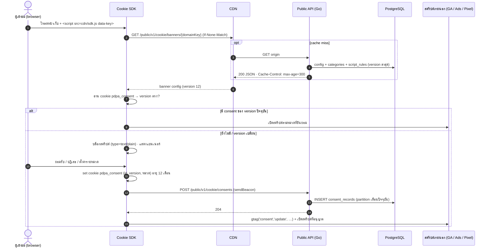

# SEQ-03 แบนเนอร์คุกกี้และบันทึกความยินยอม (Cookie SDK)

> SDK โหลดแบบ async · ค่าเริ่มต้น deny-all จนกว่าจะได้รับความยินยอม · config ผ่าน CDN  
> ต้นฉบับ: `design/PDPA_System_Analysis.drawio` → หน้า **SEQ-03 Cookie banner**

## ผู้เกี่ยวข้อง

| key | ชื่อ | ประเภท |
|---|---|---|
| V | ผู้เข้าชม (browser) | ผู้ใช้ |
| SDK | Cookie SDK | frontend |
| CDN | CDN | ระบบภายนอก |
| API | Public API (Go) | backend |
| PG | PostgreSQL | data store |
| TAG | สคริปต์ภายนอก (GA / Ads / Pixel) | ระบบภายนอก |

## Diagram

## ขั้นตอน (หมายเลขตรงกับ autonumber ใน diagram)

| # | จาก → ถึง | ข้อความ / การทำงาน | frame |
|---|---|---|---|
| 1 | V → SDK | โหลดหน้าเว็บ + <script src=cdn/sdk.js data-key> |  |
| 2 | SDK → CDN | GET /public/v1/cookie/banners/{domainKey} (If-None-Match) |  |
| 3 | CDN → API | GET origin | opt [cache miss] |
| 4 | API → PG | config + categories + script_rules (version ล่าสุด) | opt [cache miss] |
| 5 | API ⇠ (ตอบกลับ) CDN | 200 JSON · Cache-Control: max-age=300 | opt [cache miss] |
| 6 | CDN ⇠ (ตอบกลับ) SDK | banner config (version 12) |  |
| 7 | SDK (ภายใน) | อ่าน cookie pdpa_consent → version ตรง? |  |
| 8 | SDK → TAG | เปิดสคริปต์ตามหมวดที่ยินยอม | alt [มี consent ของ version ปัจจุบัน] |
| 9 | SDK (ภายใน) | บล็อกสคริปต์ (type=text/plain) · แสดงแบนเนอร์ | alt / else [ยังไม่มี / version เปลี่ยน] |
| 10 | V → SDK | ยอมรับ / ปฏิเสธ / ตั้งค่ารายหมวด | alt / else [ยังไม่มี / version เปลี่ยน] |
| 11 | SDK (ภายใน) | set cookie pdpa_consent (id, version, หมวด) อายุ 12 เดือน | alt / else [ยังไม่มี / version เปลี่ยน] |
| 12 | SDK → API | POST /public/v1/cookie/consents (sendBeacon) | alt / else [ยังไม่มี / version เปลี่ยน] |
| 13 | API → PG | INSERT consent_records (partition เดือนปัจจุบัน) | alt / else [ยังไม่มี / version เปลี่ยน] |
| 14 | API ⇠ (ตอบกลับ) SDK | 204 | alt / else [ยังไม่มี / version เปลี่ยน] |
| 15 | SDK → TAG | gtag('consent','update', …) + เปิดสคริปต์ที่อนุญาต | alt / else [ยังไม่มี / version เปลี่ยน] |

## ข้อกำหนดสำหรับนักพัฒนา

- POST ตรวจ Origin กับ allowlist ของ domain · rate limit ต่อ IP · ไม่เก็บ IP เต็ม (hash + salt รายวัน)
- Consent Mode v2: ad_storage · analytics_storage · ad_user_data · ad_personalization
- SDK ต้องไม่บล็อกการ render: โหลด async และขนาด < 30 KB (gzip)
- banner version เปลี่ยนเมื่อเพิ่ม / เปลี่ยนหมวด → ขอความยินยอมใหม่

## Module ที่เกี่ยวข้อง

- [CON — คุกกี้และความยินยอม (Cookies & Consent)](../modules/CON.md)
