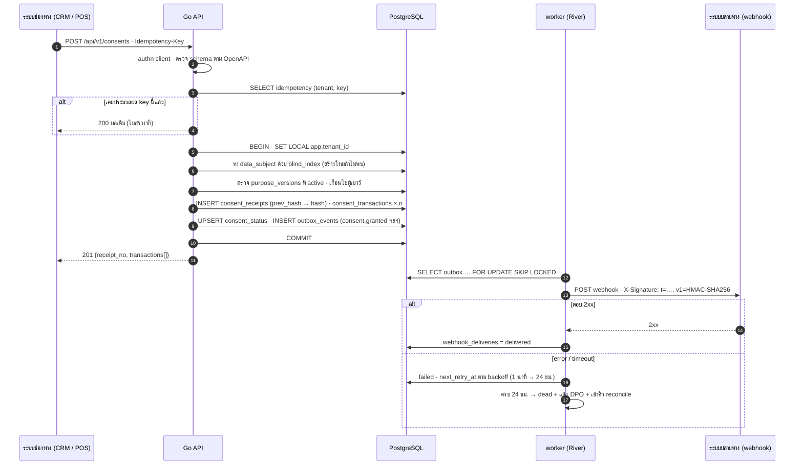

# SEQ-04 Consent API: idempotency + transaction + outbox + webhook

> ระบบช่องทาง (CRM / POS / แอป) ส่ง consent ผ่าน /api/v1 · ระบบปลายทางได้รับ event ผ่าน webhook ที่ลงลายมือชื่อ HMAC  
> ต้นฉบับ: `design/PDPA_System_Analysis.drawio` → หน้า **SEQ-04 Consent API + webhook**

## ผู้เกี่ยวข้อง

| key | ชื่อ | ประเภท |
|---|---|---|
| CH | ระบบช่องทาง (CRM / POS) | ระบบภายนอก |
| API | Go API | backend |
| PG | PostgreSQL | data store |
| W | worker (River) | backend |
| SUB | ระบบปลายทาง (webhook) | ระบบภายนอก |

## Diagram

## ขั้นตอน (หมายเลขตรงกับ autonumber ใน diagram)

| # | จาก → ถึง | ข้อความ / การทำงาน | frame |
|---|---|---|---|
| 1 | CH → API | POST /api/v1/consents · Idempotency-Key |  |
| 2 | API (ภายใน) | authn client · ตรวจ schema ตาม OpenAPI |  |
| 3 | API → PG | SELECT idempotency (tenant, key) |  |
| 4 | API ⇠ (ตอบกลับ) CH | 200 ผลเดิม (ไม่สร้างซ้ำ) | alt [เคยประมวลผล key นี้แล้ว] |
| 5 | API → PG | BEGIN · SET LOCAL app.tenant_id |  |
| 6 | API → PG | หา data_subject ด้วย blind_index (สร้างใหม่ถ้าไม่พบ) |  |
| 7 | API → PG | ตรวจ purpose_versions ที่ active · เงื่อนไขผู้เยาว์ |  |
| 8 | API → PG | INSERT consent_receipts (prev_hash → hash) · consent_transactions × n |  |
| 9 | API → PG | UPSERT consent_status · INSERT outbox_events (consent.granted ฯลฯ) |  |
| 10 | API → PG | COMMIT |  |
| 11 | API ⇠ (ตอบกลับ) CH | 201 {receipt_no, transactions[]} |  |
| 12 | W → PG | SELECT outbox … FOR UPDATE SKIP LOCKED |  |
| 13 | W → SUB | POST webhook · X-Signature: t=…, v1=HMAC-SHA256 |  |
| 14 | SUB ⇠ (ตอบกลับ) W | 2xx | alt [ตอบ 2xx] |
| 15 | W → PG | webhook_deliveries = delivered | alt [ตอบ 2xx] |
| 16 | W → PG | failed · next_retry_at ตาม backoff (1 นาที → 24 ชม.) | alt / else [error / timeout] |
| 17 | W (ภายใน) | ครบ 24 ชม. → dead + แจ้ง DPO + เข้าคิว reconcile | alt / else [error / timeout] |

## ข้อกำหนดสำหรับนักพัฒนา

- Idempotency-Key เก็บ 24 ชม. (unique tenant_id + key) · body ต่างจากเดิม → 422
- receipt hash = SHA-256(prev_hash + canonical JSON) ตรวจ chain ย้อนหลังได้
- ขั้น 5–10 อยู่ใน transaction เดียว: ถ้า fail ไม่มี event หลุดออกไป (outbox)
- ผู้รับ webhook ตรวจ timestamp ≤ 5 นาที และ event id ซ้ำ (idempotent)
- rate limit ต่อ client ตาม api_clients.rate_limit_per_min
- OAuth2 client credentials · scope ที่ต้องมี: consent.record.create

## Module ที่เกี่ยวข้อง

- [CON — คุกกี้และความยินยอม (Cookies & Consent)](../modules/CON.md)
- [PLT — โครงสร้างพื้นฐานแพลตฟอร์ม (Platform Foundation)](../modules/PLT.md)
