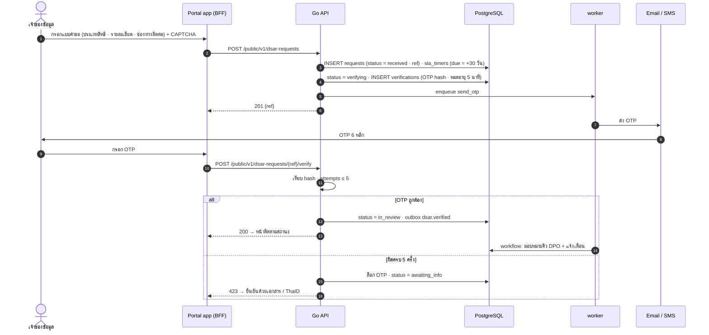

# SEQ-05 ยื่นคำขอใช้สิทธิ (DSAR) และยืนยันตัวตนด้วย OTP

> Portal สำหรับเจ้าของข้อมูล · SLA เริ่มนับเมื่อได้รับคำขอ · ไม่เปิดเผยว่ามีข้อมูลในระบบหรือไม่จนกว่าจะยืนยันตัวตน  
> ต้นฉบับ: `design/PDPA_System_Analysis.drawio` → หน้า **SEQ-05 DSAR + OTP**

## ผู้เกี่ยวข้อง

| key | ชื่อ | ประเภท |
|---|---|---|
| DS | เจ้าของข้อมูล | ผู้ใช้ |
| PT | Portal app (BFF) | frontend |
| API | Go API | backend |
| PG | PostgreSQL | data store |
| W | worker | backend |
| MSG | Email / SMS | ระบบภายนอก |

## Diagram

## ขั้นตอน (หมายเลขตรงกับ autonumber ใน diagram)

| # | จาก → ถึง | ข้อความ / การทำงาน | frame |
|---|---|---|---|
| 1 | DS → PT | กรอกแบบคำขอ (ประเภทสิทธิ · รายละเอียด · ช่องทางติดต่อ) + CAPTCHA |  |
| 2 | PT → API | POST /public/v1/dsar-requests |  |
| 3 | API → PG | INSERT requests (status = received · ref) · sla_timers (due = +30 วัน) |  |
| 4 | API → PG | status = verifying · INSERT verifications (OTP hash · หมดอายุ 5 นาที) |  |
| 5 | API → W | enqueue send_otp |  |
| 6 | API ⇠ (ตอบกลับ) PT | 201 {ref} |  |
| 7 | W → MSG | ส่ง OTP |  |
| 8 | MSG → DS | OTP 6 หลัก |  |
| 9 | DS → PT | กรอก OTP |  |
| 10 | PT → API | POST /public/v1/dsar-requests/{ref}/verify |  |
| 11 | API (ภายใน) | เทียบ hash · attempts ≤ 5 |  |
| 12 | API → PG | status = in_review · outbox dsar.verified | alt [OTP ถูกต้อง] |
| 13 | API ⇠ (ตอบกลับ) PT | 200 → หน้าติดตามสถานะ | alt [OTP ถูกต้อง] |
| 14 | W → PG | workflow: มอบหมายคิว DPO + แจ้งเตือน | alt [OTP ถูกต้อง] |
| 15 | API → PG | ล็อก OTP · status = awaiting_info | alt / else [ผิดครบ 5 ครั้ง] |
| 16 | API ⇠ (ตอบกลับ) PT | 423 → ยืนยันด้วยเอกสาร / ThaID | alt / else [ผิดครบ 5 ครั้ง] |

## ข้อกำหนดสำหรับนักพัฒนา

- เลขอ้างอิงเดาไม่ได้ (ULID) · ตอบข้อความเดียวกันไม่ว่าจะพบข้อมูลหรือไม่
- SLA นับจาก received_at · หยุดนับได้เฉพาะสถานะที่นโยบายกำหนด (awaiting_info)
- ผู้แทน: อัปโหลดหนังสือมอบอำนาจ → เจ้าหน้าที่ตรวจ (dsar.agents)
- ThaID: login ผ่าน Keycloak identity brokering แทน OTP ได้ (assurance_level สูงกว่า)

## Module ที่เกี่ยวข้อง

- [DSAR — คำขอใช้สิทธิของเจ้าของข้อมูล (DSAR)](../modules/DSAR.md)
- [IAM — ระบบจัดการผู้ใช้และสิทธิ์ (User & Permission)](../modules/IAM.md)
