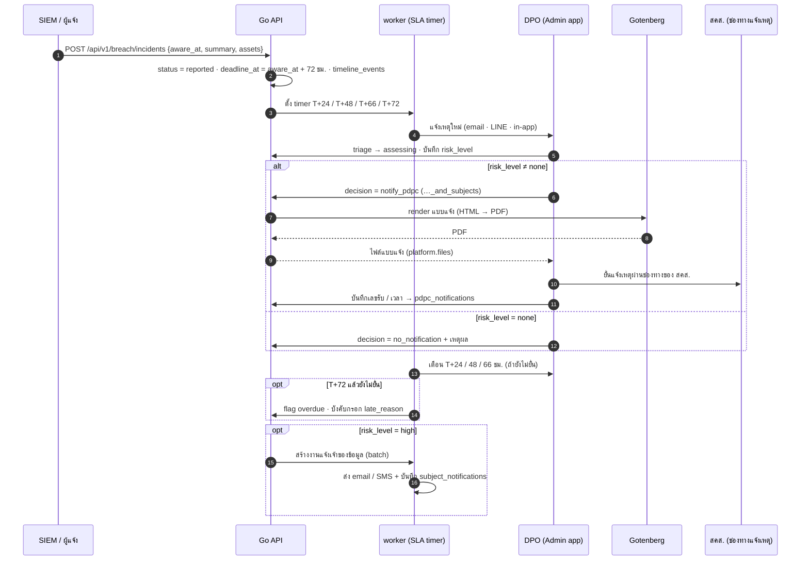

# SEQ-06 เหตุละเมิดข้อมูล: นับเวลา 72 ชม. และการแจ้ง สคส. / เจ้าของข้อมูล

> ระบบเตือนตามเวลาที่ทราบเหตุ (aware_at) และเก็บหลักฐานทุกขั้น · การยื่นต่อ สคส. ทำผ่านช่องทางของ สคส. แล้วบันทึกผลกลับเข้าระบบ  
> ต้นฉบับ: `design/PDPA_System_Analysis.drawio` → หน้า **SEQ-06 Breach 72h**

## ผู้เกี่ยวข้อง

| key | ชื่อ | ประเภท |
|---|---|---|
| SIEM | SIEM / ผู้แจ้ง | ระบบภายนอก |
| API | Go API | backend |
| W | worker (SLA timer) | backend |
| DPO | DPO (Admin app) | frontend |
| GB | Gotenberg | ระบบภายนอก |
| PDPC | สคส. (ช่องทางแจ้งเหตุ) | ระบบภายนอก |

## Diagram

## ขั้นตอน (หมายเลขตรงกับ autonumber ใน diagram)

| # | จาก → ถึง | ข้อความ / การทำงาน | frame |
|---|---|---|---|
| 1 | SIEM → API | POST /api/v1/breach/incidents {aware_at, summary, assets} |  |
| 2 | API (ภายใน) | status = reported · deadline_at = aware_at + 72 ชม. · timeline_events |  |
| 3 | API → W | ตั้ง timer T+24 / T+48 / T+66 / T+72 |  |
| 4 | W → DPO | แจ้งเหตุใหม่ (email · LINE · in-app) |  |
| 5 | DPO → API | triage → assessing · บันทึก risk_level |  |
| 6 | DPO → API | decision = notify_pdpc (…_and_subjects) | alt [risk_level ≠ none] |
| 7 | API → GB | render แบบแจ้ง (HTML → PDF) | alt [risk_level ≠ none] |
| 8 | GB ⇠ (ตอบกลับ) API | PDF | alt [risk_level ≠ none] |
| 9 | API ⇠ (ตอบกลับ) DPO | ไฟล์แบบแจ้ง (platform.files) | alt [risk_level ≠ none] |
| 10 | DPO → PDPC | ยื่นแจ้งเหตุผ่านช่องทางของ สคส. | alt [risk_level ≠ none] |
| 11 | DPO → API | บันทึกเลขรับ / เวลา → pdpc_notifications | alt [risk_level ≠ none] |
| 12 | DPO → API | decision = no_notification + เหตุผล | alt / else [risk_level = none] |
| 13 | W → DPO | เตือน T+24 / 48 / 66 ชม. (ถ้ายังไม่ยื่น) |  |
| 14 | W → API | flag overdue · บังคับกรอก late_reason | opt [T+72 แล้วยังไม่ยื่น] |
| 15 | API → W | สร้างงานแจ้งเจ้าของข้อมูล (batch) | opt [risk_level = high] |
| 16 | W (ภายใน) | ส่ง email / SMS + บันทึก subject_notifications | opt [risk_level = high] |

## ข้อกำหนดสำหรับนักพัฒนา

- aware_at แก้ได้เฉพาะ DPO พร้อมเหตุผล (audit)
- ทุก action append timeline_events (ห้ามแก้ / ลบ) ใช้เป็นหลักฐาน
- แจ้งเกิน 72 ชม.: ต้องมี late_reason และยื่นไม่เกิน 15 วันนับแต่ทราบเหตุ
- ส่งแจ้งเจ้าของข้อมูลเป็น batch ผ่าน worker (rate limit ต่อ provider)

## Module ที่เกี่ยวข้อง

- [BRE — แจ้งเหตุละเมิดข้อมูล (Data Breach Notification)](../modules/BRE.md)
