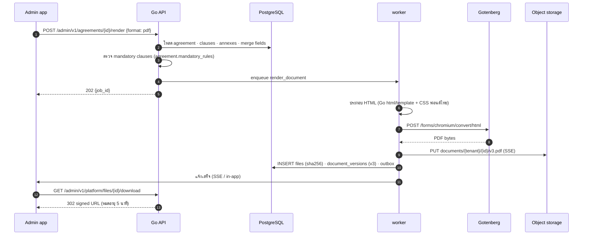

# SEQ-07 สร้างเอกสาร DPA / DSA / ประกาศ เป็น PDF (Gotenberg)

> ใช้ร่วมกับ agreement, notice, breach form และรายงาน · งานใหญ่ทำแบบ async ผ่าน worker  
> ต้นฉบับ: `design/PDPA_System_Analysis.drawio` → หน้า **SEQ-07 Document PDF**

## ผู้เกี่ยวข้อง

| key | ชื่อ | ประเภท |
|---|---|---|
| U | Admin app | frontend |
| API | Go API | backend |
| PG | PostgreSQL | data store |
| W | worker | backend |
| GB | Gotenberg | ระบบภายนอก |
| S3 | Object storage | data store |

## Diagram

## ขั้นตอน (หมายเลขตรงกับ autonumber ใน diagram)

| # | จาก → ถึง | ข้อความ / การทำงาน | frame |
|---|---|---|---|
| 1 | U → API | POST /admin/v1/agreements/{id}/render {format: pdf} |  |
| 2 | API → PG | โหลด agreement · clauses · annexes · merge fields |  |
| 3 | API (ภายใน) | ตรวจ mandatory clauses (agreement.mandatory_rules) |  |
| 4 | API → W | enqueue render_document |  |
| 5 | API ⇠ (ตอบกลับ) U | 202 {job_id} |  |
| 6 | W (ภายใน) | ประกอบ HTML (Go html/template + CSS ฟอนต์ไทย) |  |
| 7 | W → GB | POST /forms/chromium/convert/html |  |
| 8 | GB ⇠ (ตอบกลับ) W | PDF bytes |  |
| 9 | W → S3 | PUT documents/{tenant}/{id}/v3.pdf (SSE) |  |
| 10 | W → PG | INSERT files (sha256) · document_versions (v3) · outbox |  |
| 11 | W → U | แจ้งเสร็จ (SSE / in-app) |  |
| 12 | U → API | GET /admin/v1/platform/files/{id}/download |  |
| 13 | API ⇠ (ตอบกลับ) U | 302 signed URL (หมดอายุ 5 นาที) |  |

## ข้อกำหนดสำหรับนักพัฒนา

- DOCX: merge field ลง .docx template แล้วแปลง PDF ผ่าน Gotenberg (LibreOffice route) เมื่อต้องการ
- ฉบับที่ส่งลงนาม / ลงนามแล้วแก้ไขไม่ได้ (sha256 ใน document_versions)
- Gotenberg อยู่ใน network ภายใน ไม่มี egress (กัน SSRF จาก HTML)
- ไฟล์ทุกไฟล์ผ่าน ClamAV ก่อนให้ดาวน์โหลด (platform.files.scan_status)

## Module ที่เกี่ยวข้อง

- [PLT — โครงสร้างพื้นฐานแพลตฟอร์ม (Platform Foundation)](../modules/PLT.md)
- [PNG — ประกาศความเป็นส่วนตัว (Privacy Notice Generator)](../modules/PNG.md)
- [DPA — ข้อตกลงการประมวลผลข้อมูล (DPA)](../modules/DPA.md)
- [DSA — ข้อตกลงการแบ่งปันข้อมูล (DSA)](../modules/DSA.md)
