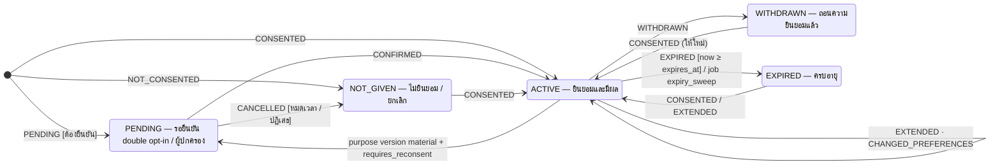

# ST-01 สถานะความยินยอม (consent.consent_status.status)

> หนึ่งแถวต่อ เจ้าของข้อมูล × purpose · ข้อความบนเส้น = consent_transactions.transaction_type ที่ทำให้เปลี่ยนสถานะ (บันทึกใน tx เดียวกับ UPSERT สถานะและ outbox event)  
> ต้นฉบับ: `design/PDPA_System_Analysis.drawio` → หน้า **ST-01 Consent status**

## Consent status

คอลัมน์ `consent.consent_status.status` · ค่าที่อนุญาต (CHECK ใน DDL): `ACTIVE`, `NOT_GIVEN`, `WITHDRAWN`, `EXPIRED`, `PENDING`

### ตาราง transition

| จาก | ไป | trigger [guard] / action |
|---|---|---|
| [*] | PENDING | PENDING [ต้องยืนยัน] |
| [*] | ACTIVE | CONSENTED |
| [*] | NOT_GIVEN | NOT_CONSENTED |
| PENDING | ACTIVE | CONFIRMED |
| ACTIVE | PENDING | purpose version material + requires_reconsent |
| PENDING | NOT_GIVEN | CANCELLED [หมดเวลา / ปฏิเสธ] |
| NOT_GIVEN | ACTIVE | CONSENTED |
| ACTIVE | WITHDRAWN | WITHDRAWN |
| WITHDRAWN | ACTIVE | CONSENTED (ให้ใหม่) |
| ACTIVE | EXPIRED | EXPIRED [now ≥ expires_at] / job expiry_sweep |
| EXPIRED | ACTIVE | CONSENTED / EXTENDED |
| ACTIVE | ACTIVE | EXTENDED · CHANGED_PREFERENCES |

### สถานะ

| สถานะ | ความหมาย | เริ่มต้น | สิ้นสุด |
|---|---|---|---|
| PENDING | รอยืนยัน double opt-in / ผู้ปกครอง | ใช่ |  |
| ACTIVE | ยินยอมและมีผล | ใช่ |  |
| NOT_GIVEN | ไม่ยินยอม / ยกเลิก | ใช่ |  |
| WITHDRAWN | ถอนความยินยอมแล้ว |  |  |
| EXPIRED | ครบอายุ |  |  |

## กติกาสำหรับนักพัฒนา

- ทุก transition = INSERT consent_transactions + UPSERT consent_status + INSERT outbox_events ใน DB tx เดียว
- ห้าม UPDATE status ตรง ๆ โดยไม่มี transaction (เขียนได้จาก consent service เท่านั้น)
- EXPIRED ถูกตั้งโดย job consent.expiry_sweep (River cron รายวัน)
- ความยินยอมผู้เยาว์: PENDING จนกว่า guardian_approvals = approved
- สถานะที่ถือว่าประมวลผลได้: ACTIVE เท่านั้น

## วิธี implement (บังคับทุก state machine)

- เปลี่ยนสถานะผ่าน method ของ service ใน module เจ้าของตารางเท่านั้น — ห้าม UPDATE คอลัมน์ status ตรงจาก handler หรือ module อื่น
- ตาราง transition ด้านบนคือ allow-list: สร้าง map ใน Go จาก `docs/states/state-machines.yaml` แล้วปฏิเสธ transition อื่นด้วย 409 problem+json (`code: <module>.invalid_transition`)
- ใน transaction เดียวกัน: UPDATE status + row_version, INSERT platform.audit_log และ INSERT platform.outbox_events (event ของ module ถ้ามี)
- test: ทุก transition ที่อนุญาต 1 case + transition ที่ไม่อนุญาตอย่างน้อย 1 case ต่อสถานะ + guard ทุกตัว

## Module ที่เกี่ยวข้อง

- [CON — คุกกี้และความยินยอม (Cookies & Consent)](../modules/CON.md)
