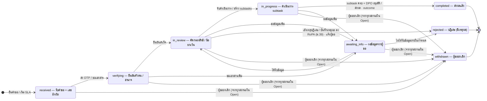

# ST-02 คำขอใช้สิทธิ (dsar.requests.status)

> กรอบประ = สถานะที่ยังเปิดอยู่ (ผู้ขอยกเลิกได้ทุกสถานะในกรอบ) · SLA (platform.workflow_instances.sla_status) ทำงานคู่ขนาน: on_track → at_risk (วันที่ 20) → overdue (วันที่ 30)  
> ต้นฉบับ: `design/PDPA_System_Analysis.drawio` → หน้า **ST-02 DSAR request**

## DSAR request

คอลัมน์ `dsar.requests.status` · ค่าที่อนุญาต (CHECK ใน DDL): `received`, `verifying`, `in_review`, `in_progress`, `awaiting_info`, `completed`, `rejected`, `withdrawn`

กลุ่ม **Open (ยังไม่ปิด)** = `received`, `verifying`, `in_review`, `in_progress`, `awaiting_info` (transition จากกลุ่มถูกกระจายเป็นรายสถานะใน diagram และตาราง)

### ตาราง transition

| จาก | ไป | trigger [guard] / action |
|---|---|---|
| [*] | received | ยื่นคำขอ / เริ่ม SLA |
| received | verifying | ส่ง OTP / ขอเอกสาร |
| verifying | in_review | ยืนยันสำเร็จ |
| in_review | in_progress | รับดำเนินการ / สร้าง subtasks |
| in_progress | completed | subtask ครบ + DPO อนุมัติ / ส่งผล · outcome |
| verifying | awaiting_info | ขอเอกสารเพิ่ม |
| in_review | awaiting_info | ขอข้อมูลเพิ่ม |
| awaiting_info | in_review | ได้รับข้อมูล |
| in_progress | awaiting_info | ขอข้อมูลเพิ่ม |
| in_review | rejected | เข้าเหตุปฏิเสธ / บันทึกเหตุผล ลง RoPA (ม.39) · แจ้งผู้ขอ |
| awaiting_info | rejected | ไม่ได้รับข้อมูลภายในกำหนด |
| received | withdrawn | ผู้ขอยกเลิก (จากทุกสถานะใน Open) |
| verifying | withdrawn | ผู้ขอยกเลิก (จากทุกสถานะใน Open) |
| in_review | withdrawn | ผู้ขอยกเลิก (จากทุกสถานะใน Open) |
| in_progress | withdrawn | ผู้ขอยกเลิก (จากทุกสถานะใน Open) |
| awaiting_info | withdrawn | ผู้ขอยกเลิก (จากทุกสถานะใน Open) |
| completed | [*] | — |
| rejected | [*] | — |
| withdrawn | [*] | — |

### สถานะ

| สถานะ | ความหมาย | เริ่มต้น | สิ้นสุด |
|---|---|---|---|
| received | รับคำขอ + เลขอ้างอิง | ใช่ |  |
| verifying | ยืนยันตัวตน / อำนาจ |  |  |
| in_review | คัดกรองสิทธิ / ข้อยกเว้น |  |  |
| in_progress | ดำเนินการ subtask |  |  |
| awaiting_info | รอข้อมูลจากผู้ขอ |  |  |
| completed | ส่งผลแล้ว |  | ใช่ |
| rejected | ปฏิเสธ (มีเหตุผล) |  | ใช่ |
| withdrawn | ผู้ขอยกเลิก |  | ใช่ |

## กติกาสำหรับนักพัฒนา

- เปลี่ยนสถานะผ่าน workflow engine เท่านั้น (platform.workflow_instances) พร้อม audit
- rejected ต้องมี reject_reason และสร้างรายการปฏิเสธใน RoPA
- completed ต้องมี outcome (fulfilled / partially_fulfilled) และ package / communication ที่ส่งแล้ว
- awaiting_info หยุดนับ SLA ได้ถ้า request_type กำหนด pause_sla = true
- withdrawn: ผู้ขอยกเลิกผ่าน portal / เจ้าหน้าที่บันทึกแทน

## วิธี implement (บังคับทุก state machine)

- เปลี่ยนสถานะผ่าน method ของ service ใน module เจ้าของตารางเท่านั้น — ห้าม UPDATE คอลัมน์ status ตรงจาก handler หรือ module อื่น
- ตาราง transition ด้านบนคือ allow-list: สร้าง map ใน Go จาก `docs/states/state-machines.yaml` แล้วปฏิเสธ transition อื่นด้วย 409 problem+json (`code: <module>.invalid_transition`)
- ใน transaction เดียวกัน: UPDATE status + row_version, INSERT platform.audit_log และ INSERT platform.outbox_events (event ของ module ถ้ามี)
- test: ทุก transition ที่อนุญาต 1 case + transition ที่ไม่อนุญาตอย่างน้อย 1 case ต่อสถานะ + guard ทุกตัว

## Module ที่เกี่ยวข้อง

- [DSAR — คำขอใช้สิทธิของเจ้าของข้อมูล (DSAR)](../modules/DSAR.md)
