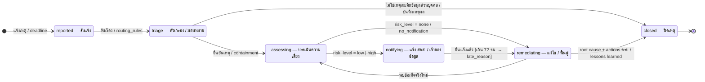

# ST-03 เหตุละเมิดข้อมูล (breach.incidents.status)

> เวลาอ้างอิง: aware_at (ทราบเหตุ) → deadline_at = aware_at + 72 ชม. · decision: no_notification | notify_pdpc | notify_pdpc_and_subjects  
> ต้นฉบับ: `design/PDPA_System_Analysis.drawio` → หน้า **ST-03 Breach incident**

## Breach incident

คอลัมน์ `breach.incidents.status` · ค่าที่อนุญาต (CHECK ใน DDL): `reported`, `triage`, `assessing`, `notifying`, `remediating`, `closed`

### ตาราง transition

| จาก | ไป | trigger [guard] / action |
|---|---|---|
| [*] | reported | แจ้งเหตุ / deadline |
| reported | triage | รับเรื่อง / routing_rules |
| triage | assessing | ยืนยันเหตุ / containment |
| assessing | notifying | risk_level = low \| high |
| assessing | remediating | risk_level = none / no_notification |
| remediating | assessing | พบข้อเท็จจริงใหม่ |
| notifying | remediating | ยื่นแจ้งแล้ว [เกิน 72 ชม. → late_reason] |
| triage | closed | ไม่ใช่เหตุละเมิดข้อมูลส่วนบุคคล / บันทึกเหตุผล |
| remediating | closed | root cause + actions ครบ / lessons learned |
| closed | [*] | — |

### สถานะ

| สถานะ | ความหมาย | เริ่มต้น | สิ้นสุด |
|---|---|---|---|
| reported | รับแจ้ง | ใช่ |  |
| triage | คัดกรอง / มอบหมาย |  |  |
| assessing | ประเมินความเสี่ยง |  |  |
| notifying | แจ้ง สคส. / เจ้าของข้อมูล |  |  |
| remediating | แก้ไข / ฟื้นฟู |  |  |
| closed | ปิดเหตุ |  | ใช่ |

## กติกาสำหรับนักพัฒนา

- เข้า notifying ได้เมื่อมี assessment ที่อนุมัติแล้ว
- ออกจาก notifying ต้องมี pdpc_notifications (และ subject_notifications ถ้า decision รวมเจ้าของข้อมูล)
- ทุกการเปลี่ยนสถานะ append timeline_events
- timer ทำงานตั้งแต่ reported ถึงยื่นแจ้ง: เตือน T+24 / 48 / 66 ชม. · T+72 → overdue
- closed แก้ไขไม่ได้ (reopen = timeline event + กลับไป assessing โดย DPO)

## วิธี implement (บังคับทุก state machine)

- เปลี่ยนสถานะผ่าน method ของ service ใน module เจ้าของตารางเท่านั้น — ห้าม UPDATE คอลัมน์ status ตรงจาก handler หรือ module อื่น
- ตาราง transition ด้านบนคือ allow-list: สร้าง map ใน Go จาก `docs/states/state-machines.yaml` แล้วปฏิเสธ transition อื่นด้วย 409 problem+json (`code: <module>.invalid_transition`)
- ใน transaction เดียวกัน: UPDATE status + row_version, INSERT platform.audit_log และ INSERT platform.outbox_events (event ของ module ถ้ามี)
- test: ทุก transition ที่อนุญาต 1 case + transition ที่ไม่อนุญาตอย่างน้อย 1 case ต่อสถานะ + guard ทุกตัว

## Module ที่เกี่ยวข้อง

- [BRE — แจ้งเหตุละเมิดข้อมูล (Data Breach Notification)](../modules/BRE.md)
