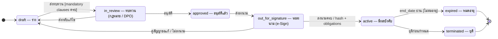
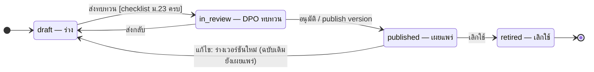

# ST-04 ข้อตกลง DPA / DSA และประกาศความเป็นส่วนตัว

> agreement.agreements.status และ notice.notices.status · ขั้นอนุมัติใช้ platform.approvals · ฉบับที่แก้ไขไม่ได้เก็บใน document_versions / notice_versions  
> ต้นฉบับ: `design/PDPA_System_Analysis.drawio` → หน้า **ST-04 Agreement & Notice**

## Agreement (agreement.agreements.status)

คอลัมน์ `agreement.agreements.status` · ค่าที่อนุญาต (CHECK ใน DDL): `draft`, `in_review`, `approved`, `out_for_signature`, `active`, `expired`, `terminated`

### ตาราง transition

| จาก | ไป | trigger [guard] / action |
|---|---|---|
| [*] | draft | — |
| draft | in_review | ส่งทบทวน [mandatory clauses ครบ] |
| in_review | draft | ส่งกลับแก้ไข |
| in_review | approved | อนุมัติ |
| approved | out_for_signature | ส่งลงนาม |
| out_for_signature | draft | คู่สัญญาขอแก้ / ไม่ลงนาม |
| out_for_signature | active | ลงนามครบ / hash + obligations |
| active | expired | end_date ผ่าน [ไม่ต่ออายุ] |
| active | terminated | ยุติก่อนกำหนด |
| expired | [*] | — |
| terminated | [*] | — |

### สถานะ

| สถานะ | ความหมาย | เริ่มต้น | สิ้นสุด |
|---|---|---|---|
| draft | ร่าง | ใช่ |  |
| in_review | ทบทวน (กฎหมาย / DPO) |  |  |
| approved | อนุมัติแล้ว |  |  |
| out_for_signature | รอลงนาม (e-Sign) |  |  |
| active | มีผลบังคับ |  |  |
| expired | หมดอายุ |  | ใช่ |
| terminated | ยุติ |  | ใช่ |

## Notice (notice.notices.status) — แต่ละ publish สร้าง notice_versions ใหม่

คอลัมน์ `notice.notices.status` · ค่าที่อนุญาต (CHECK ใน DDL): `draft`, `in_review`, `published`, `retired`

### ตาราง transition

| จาก | ไป | trigger [guard] / action |
|---|---|---|
| [*] | draft | — |
| draft | in_review | ส่งทบทวน [checklist ม.23 ครบ] |
| in_review | draft | ส่งกลับ |
| in_review | published | อนุมัติ / publish version |
| published | draft | แก้ไข: ร่างเวอร์ชันใหม่ (ฉบับเดิมยังเผยแพร่) |
| published | retired | เลิกใช้ |
| retired | [*] | — |

### สถานะ

| สถานะ | ความหมาย | เริ่มต้น | สิ้นสุด |
|---|---|---|---|
| draft | ร่าง | ใช่ |  |
| in_review | DPO ทบทวน |  |  |
| published | เผยแพร่ |  |  |
| retired | เลิกใช้ |  | ใช่ |

## กติกาสำหรับนักพัฒนา

- amendment ของข้อตกลงที่ active: สร้าง agreement ใหม่อ้างอิงฉบับเดิม ฉบับเดิมยัง active จนฉบับใหม่ลงนาม
- expired ตั้งโดย job รายวัน · แจ้งเตือนล่วงหน้า 60 / 30 วัน
- terminated / expired → สร้างงาน return_confirmations กับคู่สัญญา
- notice: เปลี่ยนสาระสำคัญ (change_type = material) → ต้องแจ้ง / ขอรับทราบใหม่

## วิธี implement (บังคับทุก state machine)

- เปลี่ยนสถานะผ่าน method ของ service ใน module เจ้าของตารางเท่านั้น — ห้าม UPDATE คอลัมน์ status ตรงจาก handler หรือ module อื่น
- ตาราง transition ด้านบนคือ allow-list: สร้าง map ใน Go จาก `docs/states/state-machines.yaml` แล้วปฏิเสธ transition อื่นด้วย 409 problem+json (`code: <module>.invalid_transition`)
- ใน transaction เดียวกัน: UPDATE status + row_version, INSERT platform.audit_log และ INSERT platform.outbox_events (event ของ module ถ้ามี)
- test: ทุก transition ที่อนุญาต 1 case + transition ที่ไม่อนุญาตอย่างน้อย 1 case ต่อสถานะ + guard ทุกตัว

## Module ที่เกี่ยวข้อง

- [DPA — ข้อตกลงการประมวลผลข้อมูล (DPA)](../modules/DPA.md)
- [DSA — ข้อตกลงการแบ่งปันข้อมูล (DSA)](../modules/DSA.md)
- [PNG — ประกาศความเป็นส่วนตัว (Privacy Notice Generator)](../modules/PNG.md)
