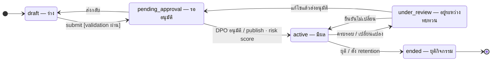
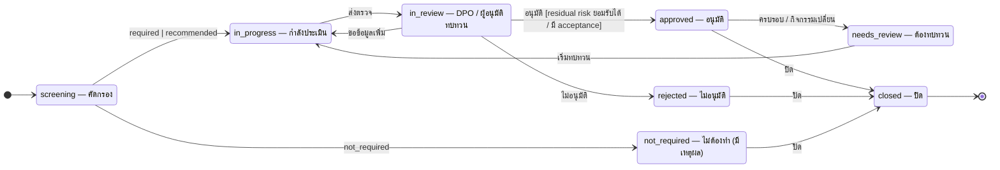

# ST-05 กิจกรรม RoPA และแบบประเมิน (DPIA / LIA / TIA)

> ropa.processing_activities.status และ assess.assessments.status · RoPA ที่เสี่ยงสูงสร้าง assessment อัตโนมัติ (event risk.dpia_required)  
> ต้นฉบับ: `design/PDPA_System_Analysis.drawio` → หน้า **ST-05 RoPA & Assessment**

## RoPA activity (ropa.processing_activities.status)

คอลัมน์ `ropa.processing_activities.status` · ค่าที่อนุญาต (CHECK ใน DDL): `draft`, `pending_approval`, `active`, `under_review`, `ended`

### ตาราง transition

| จาก | ไป | trigger [guard] / action |
|---|---|---|
| [*] | draft | — |
| draft | pending_approval | submit [validation ผ่าน] |
| pending_approval | draft | ส่งกลับ |
| pending_approval | active | DPO อนุมัติ / publish · risk score |
| active | under_review | ครบรอบ / เปลี่ยนแปลง |
| under_review | active | ยืนยันไม่เปลี่ยน |
| under_review | pending_approval | แก้ไขแล้วส่งอนุมัติ |
| active | ended | ยุติ / ตั้ง retention |
| ended | [*] | — |

### สถานะ

| สถานะ | ความหมาย | เริ่มต้น | สิ้นสุด |
|---|---|---|---|
| draft | ร่าง | ใช่ |  |
| pending_approval | รออนุมัติ |  |  |
| active | มีผล |  |  |
| under_review | อยู่ระหว่างทบทวน |  |  |
| ended | ยุติกิจกรรม |  | ใช่ |

## Assessment (assess.assessments.status)

คอลัมน์ `assess.assessments.status` · ค่าที่อนุญาต (CHECK ใน DDL): `screening`, `not_required`, `in_progress`, `in_review`, `approved`, `rejected`, `needs_review`, `closed`

### ตาราง transition

| จาก | ไป | trigger [guard] / action |
|---|---|---|
| [*] | screening | — |
| screening | not_required | not_required |
| screening | in_progress | required \| recommended |
| in_progress | in_review | ส่งตรวจ |
| in_review | in_progress | ขอข้อมูลเพิ่ม |
| in_review | approved | อนุมัติ [residual risk ยอมรับได้ / มี acceptance] |
| in_review | rejected | ไม่อนุมัติ |
| approved | needs_review | ครบรอบ / กิจกรรมเปลี่ยน |
| needs_review | in_progress | เริ่มทบทวน |
| approved | closed | ปิด |
| rejected | closed | ปิด |
| not_required | closed | ปิด |
| closed | [*] | — |

### สถานะ

| สถานะ | ความหมาย | เริ่มต้น | สิ้นสุด |
|---|---|---|---|
| screening | คัดกรอง | ใช่ |  |
| not_required | ไม่ต้องทำ (มีเหตุผล) |  |  |
| in_progress | กำลังประเมิน |  |  |
| in_review | DPO / ผู้อนุมัติทบทวน |  |  |
| approved | อนุมัติ |  |  |
| rejected | ไม่อนุมัติ |  |  |
| needs_review | ต้องทบทวน |  |  |
| closed | ปิด |  | ใช่ |

## กติกาสำหรับนักพัฒนา

- แก้ไข RoPA ที่ active → สร้างเวอร์ชันใหม่ (record_versions) และเข้าสู่ under_review / pending_approval
- ended: ยังเก็บไว้ตาม retention และใช้เป็นหลักฐาน
- assessment: ความเห็น DPO (dpo_opinions) ต้องมีก่อน approved
- approved ที่มีความเสี่ยงคงเหลือสูง ต้องมี risk.acceptances ที่ยังไม่หมดอายุ

## วิธี implement (บังคับทุก state machine)

- เปลี่ยนสถานะผ่าน method ของ service ใน module เจ้าของตารางเท่านั้น — ห้าม UPDATE คอลัมน์ status ตรงจาก handler หรือ module อื่น
- ตาราง transition ด้านบนคือ allow-list: สร้าง map ใน Go จาก `docs/states/state-machines.yaml` แล้วปฏิเสธ transition อื่นด้วย 409 problem+json (`code: <module>.invalid_transition`)
- ใน transaction เดียวกัน: UPDATE status + row_version, INSERT platform.audit_log และ INSERT platform.outbox_events (event ของ module ถ้ามี)
- test: ทุก transition ที่อนุญาต 1 case + transition ที่ไม่อนุญาตอย่างน้อย 1 case ต่อสถานะ + guard ทุกตัว

## Module ที่เกี่ยวข้อง

- [ROPA — บันทึกกิจกรรมการประมวลผล (RoPA)](../modules/ROPA.md)
- [DPIA — แบบประเมินผลกระทบ (DPIA)](../modules/DPIA.md)
