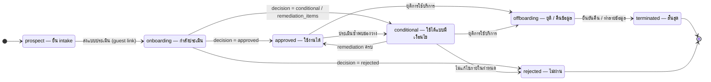

# ST-06 คู่ค้า / ผู้ประมวลผล (vendor.vendors.status)

> tier (low · medium · high · critical) กำหนดรอบประเมินซ้ำ · decision ของ vendor_assessments: approved | conditional | rejected  
> ต้นฉบับ: `design/PDPA_System_Analysis.drawio` → หน้า **ST-06 Vendor**

## Vendor

คอลัมน์ `vendor.vendors.status` · ค่าที่อนุญาต (CHECK ใน DDL): `prospect`, `onboarding`, `approved`, `conditional`, `rejected`, `offboarding`, `terminated`

### ตาราง transition

| จาก | ไป | trigger [guard] / action |
|---|---|---|
| [*] | prospect | — |
| prospect | onboarding | ส่งแบบประเมิน (guest link) |
| onboarding | approved | decision = approved |
| onboarding | conditional | decision = conditional / remediation_items |
| onboarding | rejected | decision = rejected |
| conditional | approved | remediation ครบ |
| approved | conditional | ประเมินซ้ำพบช่องว่าง |
| conditional | rejected | ไม่แก้ไขภายในกำหนด |
| approved | offboarding | ยุติการใช้บริการ |
| conditional | offboarding | ยุติการใช้บริการ |
| offboarding | terminated | ยืนยันคืน / ทำลายข้อมูล |
| terminated | [*] | — |
| rejected | [*] | — |

### สถานะ

| สถานะ | ความหมาย | เริ่มต้น | สิ้นสุด |
|---|---|---|---|
| prospect | ยื่น intake | ใช่ |  |
| onboarding | กำลังประเมิน |  |  |
| approved | ใช้งานได้ |  |  |
| conditional | ใช้ได้แบบมีเงื่อนไข |  |  |
| rejected | ไม่ผ่าน |  | ใช่ |
| offboarding | ยุติ / คืนข้อมูล |  |  |
| terminated | สิ้นสุด |  | ใช่ |

## กติกาสำหรับนักพัฒนา

- approved / conditional เท่านั้นที่เลือกเป็นผู้รับข้อมูลใน RoPA ได้
- conditional ต้องมี remediation_items ที่มี due_date และผู้รับผิดชอบ
- ใบรับรองใกล้หมดอายุ (certificates.expires_at) → แจ้งเตือนและสร้างการประเมินซ้ำ
- offboarding ต้องมี offboardings + return_confirmations ก่อน terminated

## วิธี implement (บังคับทุก state machine)

- เปลี่ยนสถานะผ่าน method ของ service ใน module เจ้าของตารางเท่านั้น — ห้าม UPDATE คอลัมน์ status ตรงจาก handler หรือ module อื่น
- ตาราง transition ด้านบนคือ allow-list: สร้าง map ใน Go จาก `docs/states/state-machines.yaml` แล้วปฏิเสธ transition อื่นด้วย 409 problem+json (`code: <module>.invalid_transition`)
- ใน transaction เดียวกัน: UPDATE status + row_version, INSERT platform.audit_log และ INSERT platform.outbox_events (event ของ module ถ้ามี)
- test: ทุก transition ที่อนุญาต 1 case + transition ที่ไม่อนุญาตอย่างน้อย 1 case ต่อสถานะ + guard ทุกตัว

## Module ที่เกี่ยวข้อง

- [VEN — ประเมินคู่ค้า (Vendor Assessment)](../modules/VEN.md)
