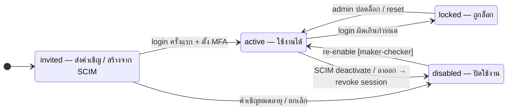
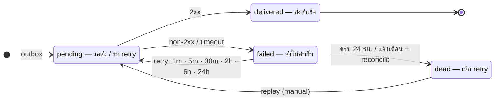

# ST-07 บัญชีผู้ใช้ (iam.users.status) และการส่ง webhook (platform.webhook_deliveries.status)

> สองสถานะที่มีผลต่อความปลอดภัยและความถูกต้องของการเชื่อมต่อ  
> ต้นฉบับ: `design/PDPA_System_Analysis.drawio` → หน้า **ST-07 User & Webhook**

## User account

คอลัมน์ `iam.users.status` · ค่าที่อนุญาต (CHECK ใน DDL): `invited`, `active`, `disabled`, `locked`

### ตาราง transition

| จาก | ไป | trigger [guard] / action |
|---|---|---|
| [*] | invited | — |
| invited | active | login ครั้งแรก + ตั้ง MFA |
| invited | disabled | คำเชิญหมดอายุ / ยกเลิก |
| active | locked | login ผิดเกินกำหนด |
| locked | active | admin ปลดล็อก / reset |
| active | disabled | SCIM deactivate / ลาออก → revoke session |
| disabled | active | re-enable [maker-checker] |

### สถานะ

| สถานะ | ความหมาย | เริ่มต้น | สิ้นสุด |
|---|---|---|---|
| invited | ส่งคำเชิญ / สร้างจาก SCIM | ใช่ |  |
| active | ใช้งานได้ |  |  |
| locked | ถูกล็อก |  |  |
| disabled | ปิดใช้งาน |  |  |

## Webhook delivery

คอลัมน์ `platform.webhook_deliveries.status` · ค่าที่อนุญาต (CHECK ใน DDL): `pending`, `delivered`, `failed`, `dead`

### ตาราง transition

| จาก | ไป | trigger [guard] / action |
|---|---|---|
| [*] | pending | outbox |
| pending | delivered | 2xx |
| pending | failed | non-2xx / timeout |
| failed | pending | retry: 1m · 5m · 30m · 2h · 6h · 24h |
| failed | dead | ครบ 24 ชม. / แจ้งเตือน + reconcile |
| dead | pending | replay (manual) |
| delivered | [*] | — |

### สถานะ

| สถานะ | ความหมาย | เริ่มต้น | สิ้นสุด |
|---|---|---|---|
| pending | รอส่ง / รอ retry | ใช่ |  |
| delivered | ส่งสำเร็จ |  | ใช่ |
| failed | ส่งไม่สำเร็จ |  |  |
| dead | เลิก retry |  |  |

## กติกาสำหรับนักพัฒนา

- disabled / locked: ปฏิเสธทุก request ทันที (ตรวจสถานะใน middleware + ล้าง cache สิทธิ์)
- disable จาก SCIM ต้อง revoke refresh token ใน Keycloak และลบ session ใน Valkey
- webhook: next_retry_at ตาม backoff · ปิด subscription อัตโนมัติถ้า dead ต่อเนื่อง 3 วัน
- replay ต้องมีสิทธิ์ admin.apiclient.update และบันทึก audit

## วิธี implement (บังคับทุก state machine)

- เปลี่ยนสถานะผ่าน method ของ service ใน module เจ้าของตารางเท่านั้น — ห้าม UPDATE คอลัมน์ status ตรงจาก handler หรือ module อื่น
- ตาราง transition ด้านบนคือ allow-list: สร้าง map ใน Go จาก `docs/states/state-machines.yaml` แล้วปฏิเสธ transition อื่นด้วย 409 problem+json (`code: <module>.invalid_transition`)
- ใน transaction เดียวกัน: UPDATE status + row_version, INSERT platform.audit_log และ INSERT platform.outbox_events (event ของ module ถ้ามี)
- test: ทุก transition ที่อนุญาต 1 case + transition ที่ไม่อนุญาตอย่างน้อย 1 case ต่อสถานะ + guard ทุกตัว

## Module ที่เกี่ยวข้อง

- [IAM — ระบบจัดการผู้ใช้และสิทธิ์ (User & Permission)](../modules/IAM.md)
- [PLT — โครงสร้างพื้นฐานแพลตฟอร์ม (Platform Foundation)](../modules/PLT.md)
